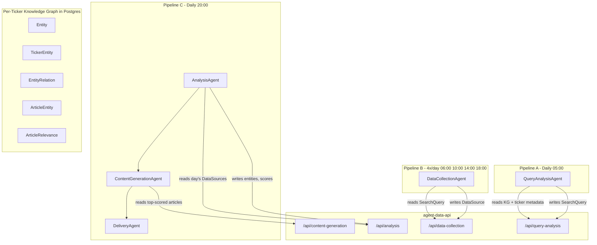
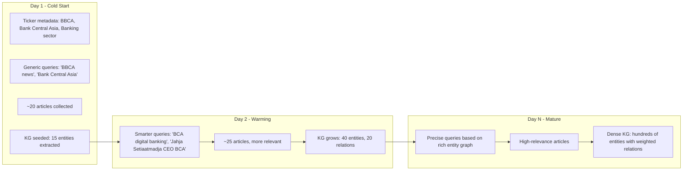

# Per-Ticker Knowledge Graph + Agent Pipeline

## Current state

- Agents are Hono apps built with `createAgentApp` (in [packages/agent-runtime](packages/agent-runtime/src/create-agent-app.ts)), receiving `{ input, config, token }`.
- Pipeline steps do NOT pass output to each other. Each step reads/writes shared state through `agent-data-api` routes. This is the communication channel.
- `SearchQuery` records have **no creation code** — they're a dead end today. The query-analysis agent fills this gap.
- `content-generation` currently feeds **all** DataSources for a ticker into the LLM prompt. No filtering or ranking.
- Ticker metadata (from IDX import) already contains sector, industry, sub-industry — useful for KG bootstrapping.

## Architecture



All agents communicate through `agent-data-api` and the shared Postgres DB. Each ticker's KG is a filtered view of global tables via `ticker_entity`.

### Schedule design

Three separate pipelines with independent schedules:

- **Pipeline A (query-analysis):** Runs once daily at 05:00. Refreshes search queries using the ticker's KG and metadata. Keywords evolve slowly, so once/day is sufficient.
- **Pipeline B (data-collection):** Runs 4x/day at 06:00, 10:00, 14:00, 18:00. Accumulates articles throughout the day to catch breaking news. First run starts 1h after query-analysis to ensure fresh queries are available.
- **Pipeline C (analysis -> content-generation -> delivery):** Runs once daily at 20:00. Scores the full day's article harvest, selects the best, generates newsletter, and sends. Running at end-of-day means the analysis agent sees all 4 collection runs before scoring.

All three pipelines fan out per subscribed ticker using the existing `db:userTicker:tickerId?where.enabled=true` expansion.

---

## Data model (new Prisma tables)

All new tables; no changes to existing ones.

### `EntityType` — admin-managed vocabulary for entity classification

- `id`, `name` (unique, e.g. "COMPANY"), `description` (guides the LLM, e.g. "A registered business or corporation"), `createdAt`, `updatedAt`
- Managed via Hermes dashboard CRUD. Seeded with defaults: COMPANY, PERSON, TOPIC, EVENT, PRODUCT, SECTOR.
- The analysis agent fetches all EntityType rows and injects them into the LLM extraction prompt so the LLM picks from admin-defined types.

### `RelationType` — admin-managed vocabulary for relationship classification

- `id`, `name` (unique, e.g. "CEO_OF"), `description` (guides the LLM, e.g. "Person is CEO of a company"), `createdAt`, `updatedAt`
- Managed via Hermes dashboard CRUD. Seeded with defaults: CEO_OF, SUBSIDIARY_OF, PARENT_OF, COMPETITOR, SECTOR_PEER, INVESTOR_IN, PARTNER_OF.
- The analysis agent fetches all RelationType rows and injects them into the LLM extraction prompt.

### `Entity` — a real-world thing (person, company, topic, etc.)

- `id`, `typeId` -> EntityType, `canonicalName`, `description?`, `metadata Json?`, `createdAt`, `updatedAt`

### `EntityAlias` — alternative names for an entity

- `id`, `entityId` -> Entity, `alias`, `normalizedAlias` (lowercased/stripped for matching), unique on `[entityId, normalizedAlias]`

### `TickerEntity` — per-ticker KG membership (this IS the per-ticker graph)

- `id`, `tickerId` -> Ticker, `entityId` -> Entity, `relevanceWeight` (0.0-1.0), `source` (enum: SEED, EXTRACTED, MANUAL), `createdAt`, `updatedAt`
- unique on `[tickerId, entityId]`

### `EntityRelation` — edges between entities

- `id`, `fromEntityId` -> Entity, `toEntityId` -> Entity, `relationTypeId` -> RelationType, `weight`, `lastSeenAt`, `createdAt`

### `ArticleEntity` — which entities appear in which article

- `id`, `dataSourceId` -> DataSource, `entityId` -> Entity, `mentionCount`, `confidence` (0.0-1.0), `sentiment?` (POSITIVE/NEGATIVE/NEUTRAL)

### `ArticleRelevance` — scored article per ticker per day

- `id`, `dataSourceId` -> DataSource, `tickerId` -> Ticker, `score` (0.0-1.0), `scoreBreakdown Json` (individual signal values), `selected` (boolean — passed to content-generation?), `scoredAt`, unique on `[dataSourceId, tickerId]`

---

## Agent 1: query-analysis (NEW)

**Purpose:** Replace manual SearchQuery creation. Uses the ticker's KG + metadata to generate targeted search queries.

**Location:** `apps/agents/query-analysis/` (new agent package)

**Input:** `{ tickerId }`

**Flow:**

1. `GET /api/query-analysis?tickerId=...` from agent-data-api -> returns ticker info (symbol, name, metadata), top TickerEntity nodes, and recent article themes.
2. Construct an LLM prompt using:

- Ticker symbol + company name + sector/industry (from metadata)
- Top KG entities (from `ticker_entity` + `entity`)
- Recent trending topics (from recent `article_entity` frequency)

1. LLM generates 5-10 search query strings (e.g. `"BBCA Bank Central Asia Q1 2026 earnings"`, `"BCA digital banking partnership"`, `"Indonesian banking sector regulation 2026"`).
2. `POST /api/query-analysis` -> upserts SearchQuery records for this ticker (replace stale ones, keep recent ones).

**On first run (empty KG):** Falls back to ticker symbol + name + sector from metadata. Queries will be generic but functional. KG builds over time.

**API routes (agent-data-api):**

- `GET /api/query-analysis?tickerId=...` -> ticker + KG context
- `POST /api/query-analysis` -> upsert SearchQuery records

---

## Agent 2: data-collection (EXISTS — minimal changes)

**Location:** [apps/agents/data-collection/](apps/agents/data-collection/src/index.ts)

**Current behavior is correct:** reads SearchQuery for ticker, web-searches, fetches full pages via Jina, stores DataSource records.

**Change needed:** None functionally. Query-analysis now creates the SearchQuery records that this agent consumes. The agents are decoupled through the DB.

---

## Agent 3: analysis (NEW) — the KG builder + article scorer

**Purpose:** This is the core intelligence layer. It:

1. Extracts entities from new articles and builds/updates the per-ticker KG.
2. Scores each article's relevance to the ticker.
3. Marks top articles as selected for the newsletter.

**Location:** `apps/agents/analysis/` (new agent package)

**Input:** `{ tickerId }`

**Flow:**

### Step A — Entity extraction

1. `GET /api/analysis?tickerId=...&unanalyzed=true` -> fetch DataSources that haven't been scored yet (no `article_relevance` row). Also returns all `EntityType` and `RelationType` rows from the DB.
2. For each article (or batched), call LLM with structured output. The prompt injects the admin-defined vocabularies:

- Entity types: `"Classify each entity as one of: COMPANY (A registered business...), PERSON (An individual...), ..."`
- Relation types: `"Classify each relationship as one of: CEO_OF (Person is CEO of...), SUBSIDIARY_OF (...), ..."`
- Extract entities: `{ name, type, aliases[], description }`.
- Extract relationships: `{ from, to, relationType }`.
- Return JSON array.

1. For each extracted entity:

- Normalize name -> check `entity_alias.normalizedAlias` for existing match.
- If match found: reuse entity, add `article_entity` link.
- If no match: create new Entity + EntityAlias + `article_entity` link.

1. Upsert `ticker_entity` (ensure this entity is in this ticker's KG).
2. Upsert `entity_relation` edges.

### Step B — Relevance scoring

For each unscored article, compute a composite score:

| Signal          | Weight | Description                                                 |
| --------------- | ------ | ----------------------------------------------------------- |
| `aliasMatch`    | 0.30   | Ticker symbol/name/aliases found in title + content         |
| `entityOverlap` | 0.30   | Proportion of article entities that are in this ticker's KG |
| `freshness`     | 0.20   | Recency decay (today=1.0, yesterday=0.8, ...)               |
| `sourceQuality` | 0.10   | Domain trust score (configurable allowlist)                 |
| `novelty`       | 0.10   | Inverse of similarity to already-selected articles (dedup)  |

Formula: `score = 0.30*aliasMatch + 0.30*entityOverlap + 0.20*freshness + 0.10*sourceQuality + 0.10*novelty`

Store as `article_relevance` with full `scoreBreakdown` JSON for observability.

### Step C — Selection

1. Rank articles by score descending.
2. Mark top K (configurable, default 10) as `selected = true`.
3. `POST /api/analysis` -> write ArticleEntity, ArticleRelevance, TickerEntity updates.

**API routes (agent-data-api):**

- `GET /api/analysis?tickerId=...&unanalyzed=true` -> unscored DataSources
- `POST /api/analysis` -> bulk write entities, relations, article-entities, scores

---

## Agent 4: content-generation (EXISTS — needs modification)

**Location:** [apps/agents/content-generation/](apps/agents/content-generation/src/index.ts)

**Current:** calls `GET /api/content-generation?tickerId=...` which returns ALL DataSources.

**Change:** Modify [agent-data-api service](apps/agent-data-api/src/services/content-generation.ts) `getDataSourcesForTicker` to return only articles where `article_relevance.selected = true` and `article_relevance.scoredAt` is today. This is a ~5-line query change, not an agent change.

```typescript
// Before
return prisma.dataSource.findMany({ where: { tickerId } });

// After
return prisma.dataSource.findMany({
  where: {
    tickerId,
    articleRelevances: {
      some: { selected: true, scoredAt: { gte: todayStart } },
    },
  },
  orderBy: { articleRelevances: { _count: "desc" } },
});
```

---

## Pipeline configuration

Three independent pipelines, each with its own schedule:

### Pipeline A — query-analysis (1x/day)

| Order | Agent          | Input                                                         |
| ----- | -------------- | ------------------------------------------------------------- |
| 1     | query-analysis | `{ "tickerId": "db:userTicker:tickerId?where.enabled=true" }` |

- Schedule: `0 5 * * *` (05:00 daily)

### Pipeline B — data-collection (4x/day)

| Order | Agent           | Input                                                         |
| ----- | --------------- | ------------------------------------------------------------- |
| 1     | data-collection | `{ "tickerId": "db:userTicker:tickerId?where.enabled=true" }` |

- Schedule: `0 6,10,14,18 * * *` (06:00, 10:00, 14:00, 18:00)

### Pipeline C — analysis + newsletter (1x/day)

| Order | Agent              | Input                                                         |
| ----- | ------------------ | ------------------------------------------------------------- |
| 1     | analysis           | `{ "tickerId": "db:userTicker:tickerId?where.enabled=true" }` |
| 2     | content-generation | `{ "tickerId": "db:userTicker:tickerId?where.enabled=true" }` |
| 3     | delivery           | `{ "tickerId": "db:userTicker:tickerId?where.enabled=true" }` |

- Schedule: `0 20 * * *` (20:00 daily — after all 4 collection runs)

All three pipelines fan out per subscribed ticker via the existing `expand-data-sources.ts` mechanism.

---

## How the KG grows over time



The query-analysis agent sees a richer KG each day, producing better queries, which find better articles, which further enrich the KG. This is the flywheel effect.

---

## File changes summary

**New files:**

- `apps/agents/query-analysis/` — new agent package (scaffolded via `turbo gen agent`)
- `apps/agents/analysis/` — new agent package
- `apps/agent-data-api/src/routes/query-analysis.ts` — new route
- `apps/agent-data-api/src/routes/analysis.ts` — new route
- `apps/agent-data-api/src/services/query-analysis.ts` — new service
- `apps/agent-data-api/src/services/analysis.ts` — new service
- `apps/agent-data-api/src/schemas/query-analysis.ts` — new schemas
- `apps/agent-data-api/src/schemas/analysis.ts` — new schemas
- `apps/hermes/app/dashboard/entity-types/` — CRUD pages for EntityType management
- `apps/hermes/app/dashboard/relation-types/` — CRUD pages for RelationType management
- `packages/database/prisma/migrations/xxx_add_knowledge_graph/` — new migration
- Seed script for default EntityType and RelationType rows

**Modified files:**

- `packages/database/prisma/schema.prisma` — add 8 new models (EntityType, RelationType, Entity, EntityAlias, TickerEntity, EntityRelation, ArticleEntity, ArticleRelevance)
- `apps/agent-data-api/src/services/content-generation.ts` — filter by selected articles
- `apps/agent-data-api/src/index.ts` — register new routes

**No changes to:**

- `apps/agents/data-collection/` — works as-is
- `apps/agents/delivery/` — works as-is
- `packages/hermes-scheduler/` — expansion mechanism already supports this
