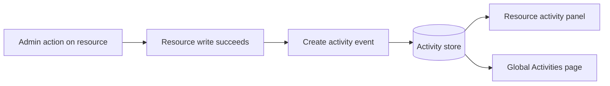

# Hermes admin activity tracking and audit view

**Version:** 1.0 | **Date:** 2026-04-18 | **Owner:** Hermes platform team

## Changelog

- 1.0 (2026-04-18): Initial PRD for cross-resource admin activity tracking, right-side activity panels, and a global activities page with filters.

## 1. Summary and context

Hermes admins can currently change important resource settings, but there is no consistent, in-product history that shows who changed what and when. That creates avoidable confusion during incidents, makes handoffs harder, and slows down debugging when behavior changes after an admin action.

This initiative adds a unified activity trail for admin actions across Hermes resources, plus UI surfaces that make the history easy to access from where admins already work.

Business and product outcomes:

- Reduce time to answer "who changed this?" during operational incidents.
- Increase confidence and accountability for admin operations.
- Provide a single source of truth for recent admin changes across resources.

Non-goals:

- This release is not a full compliance archive export system.
- This release does not add per-variable detail pages.
- This release does not implement advanced text diff viewers for long field changes.

## 2. Users and stakeholders

Primary users:

- Hermes admins who operate schedules, pipelines, variables, and agent configs.
- On-call admins who investigate regressions after config or status changes.

Stakeholders:

- Platform admins: operational ownership and workflow efficiency.
- Engineering leads: incident triage speed and change accountability.
- Product/ops managers: visibility into admin actions and change patterns.

Input sources:

- Existing Hermes detail-page workflows.
- Current right-side activity panel pattern on pipeline detail pages.
- Admin need for explicit short-value change visibility (for example, enabled -> false).

## 3. User stories and experience

- **Must (P0):** As an admin, I can open an activity panel from a resource view and see recent actions first so I can quickly understand the latest changes.
- **Must (P0):** As an admin, when a short value changes (for example boolean or enum), I can see the new value directly in the event message.
- **Must (P0):** As an admin, when a long text field changes, I see a concise message (for example "updated description") without a large value dump.
- **Must (P0):** As an admin, I can use a global Activities page and filter by admin, date range, and resource type.
- **Should (P1):** As an admin, I can access activity history in a consistent way from all supported resource detail contexts.

Critical journeys:

1. Admin opens a schedule detail page, clicks activities icon (top-right), sees right-side panel, confirms who toggled enabled status.
2. Admin opens `/dashboard/variables`, clicks activities icon, sees variable-related actions across all variables in one panel.
3. Admin uses global Activities page under `Platform > Admins`, applies filters (admin + date + resource), and reviews matching events.

Success metrics:

- At least 90% of eligible admin write actions produce an activity event record.
- Median time to identify last actor for a changed resource drops by at least 50% versus baseline support workflow.
- At least 80% of activity panel opens result in at least one relevant event in first page load.

## 4. Requirements

### Must-have (P0)

- [REQ-001] Track admin write actions for all current Hermes admin resources in scope.
  - **Acceptance criteria:**
    - Given an admin performs create, update, delete, enable/disable, or manual run action on a supported resource, when the action succeeds, then an activity event is stored.
    - Event includes actor identity, timestamp, resource type, resource identifier, action type, and field-level change summary when applicable.

- [REQ-002] Show resource-specific activity panel in supported resource contexts.
  - **Acceptance criteria:**
    - Schedules: activities icon is shown in top-right of detail page and opens a right-side panel.
    - Pipelines: existing right-side activity panel pattern is reused (no regression).
    - Variables: activities icon/panel is available on `/dashboard/variables` and lists all variable-related events, not a single-variable stream.
    - Agent configs: activities entry is available from the three-dots popover and opens the activity panel.
    - Panel appears from the right in-page layout and does not cover page content as a modal overlay.

- [REQ-003] Enforce activity message formatting rules for changed values.
  - **Acceptance criteria:**
    - For short scalar fields (booleans, enums, and compact scalar values), activity message includes the new value.
    - For long text or large payload fields, activity message uses concise generic wording (for example "updated description") and omits full new value.
    - Enable/disable changes are always explicit (for example `changed "enabled" to false`).

- [REQ-004] Provide global Activities page with required filtering.
  - **Acceptance criteria:**
    - New sidebar link is available under `Platform > Admins`.
    - Page supports filters by admin, date range, and resource type.
    - Filter state updates list results without losing descending-by-recency ordering.

- [REQ-005] Ensure deterministic sort order.
  - **Acceptance criteria:**
    - All activity lists (panel and global page) default to newest-first ordering.
    - When two events share identical timestamps, secondary deterministic ordering is applied (for example event ID descending).

- [REQ-006] Define access control for viewing activities.
  - **Acceptance criteria:**
    - Any authenticated Hermes admin can view activity streams and the global Activities page.
    - Non-admin users cannot access these views.

- [REQ-007] Retention policy for activity records.
  - **Acceptance criteria:**
    - Activity events are retained indefinitely in v1 unless an explicit platform-level retention policy supersedes this behavior.
    - No automatic TTL deletion is applied by default.

### Should-have (P1)

- [REQ-008] Use shared event model and rendering components across resources to keep behavior consistent.
  - **Acceptance criteria:**
    - Event schema and display formatting logic are reused across resource contexts.
    - Resource-specific adapters only map resource/action semantics, not duplicate core logic.

- [REQ-009] Add basic observability around activity logging.
  - **Acceptance criteria:**
    - Failed write-to-activity attempts are logged with reason and resource context.
    - Monitoring can report event logging success rate.

### Could-have (P2)

- [REQ-010] Add cursor-based pagination and export-ready endpoint shape for future reporting.
  - **Acceptance criteria:**
    - API response contract supports stable cursors and filter parameters aligned with global page filters.
    - UI can progressively load older records without reordering anomalies.

### Won't (this release)

- Rich inline text diff visualization for long text fields.
- Per-variable detail pages solely for activity browsing.
- End-user facing activity surfaces outside Hermes admin.

## 5. Functional specification

Event model (minimum fields):

- `eventId`
- `occurredAt`
- `actorAdminId`
- `actorDisplayName`
- `resourceType`
- `resourceId` (nullable only for actions that are intentionally global)
- `actionType` (create/update/delete/enable_disable/manual_run)
- `changeSummary` (human-readable event sentence)
- `metadata` (structured context for rendering/debugging)

Write-path behavior:

- Activity creation is triggered after successful admin action commit.
- For update actions, compare changed fields and generate a concise summary list.
- Formatting rule applies:
  - Short fields: include new value in sentence.
  - Long fields: omit value and mention field update only.

UI behavior:

- Resource panel uses right-side in-page panel pattern already established on pipeline detail.
- Panel header includes resource context and default newest-first stream.
- Global Activities page includes filter controls (admin/date/resource) and list view.
- Empty state: clear message when no records match current filters.
- Error state: retry affordance when loading fails.

Agent config placement:

- In agent config three-dots menu, include an activities action that opens panel scoped to selected config context.

Variables placement:

- On `/dashboard/variables`, panel shows events with `resourceType = variable` across all variables.

## 6. Non-functional requirements

- Performance:
  - Activity list initial load target <= 500ms p95 for recent records under normal admin traffic.
  - Filter application target <= 700ms p95.
- Security and privacy:
  - Only admins can view activity data.
  - Activity summaries must avoid exposing large sensitive payloads in UI by default.
- Reliability:
  - Event logging success rate target >= 99.9% for successful admin write actions.
- Accessibility:
  - Panel trigger and filters are keyboard reachable and screen-reader labeled.
- Observability:
  - Emit logs/metrics for activity event creation success/failure and query latency.

## 7. Dependencies and risks

Dependencies:

- Existing admin identity context for `actorDisplayName` and `actorAdminId`.
- Shared UI panel pattern from pipelines.
- Backend storage/query layer for activity events.

Risks:

- **Risk:** Missing events if logging is not tightly coupled to successful write paths.
  - **Mitigation:** Integrate logging in shared post-write workflow with monitoring and alerting.
- **Risk:** Message quality inconsistency across resources.
  - **Mitigation:** Centralize message formatting and short-vs-long value classification.
- **Risk:** Query latency growth with indefinite retention.
  - **Mitigation:** Add indexes and cursor-based query strategy; monitor p95 by filter shape.

## 8. Rollout and flexibility

Rollout plan:

1. Implement shared activity event model and write-path integration for required action types.
2. Ship resource panel entry points across all current resources (including variables aggregate and agent config popover entry).
3. Ship global Activities page and sidebar link under `Platform > Admins`.
4. Enable monitoring dashboards for logging success and query latency.

Flexibility after v1:

- Action taxonomy can expand without changing existing event consumers.
- Filter set can grow (for example action type or specific resource ID) as a backward-compatible extension.
- Pagination and export workflows can be added as follow-on capabilities.

Rollback:

- UI surfaces can be feature-flagged off while preserving stored event data.
- If query performance regresses, temporarily reduce panel history window in UI while backend indexing is improved.

## 9. Visuals

Activity flow:

What to take away: The audit event is written immediately after successful writes and feeds both local panel views and the global Activities page.

UI placement map:

- Resource detail pages: top-right activities icon opens right-side panel.
- Variables list page (`/dashboard/variables`): same icon/panel pattern, scoped to all variable events.
- Agent configs: activities entry in three-dots popover.
- Global nav: `Platform > Admins > Activities`.

## 10. Confirmed decisions and assumptions

- Scope includes all current Hermes admin resources for v1 resource-specific activity support.
- Required tracked actions are create, update, delete, enable/disable, and manual run.
- Value display rule: short scalar changes show new value; long text/large changes show concise field-update message only.
- Global Activities page requires filters by admin, date range, and resource type.
- Activity retention target is indefinite by default.
- Any Hermes admin can view activities.
- Delivery preference is comprehensive foundation in v1, not minimal-only implementation.
