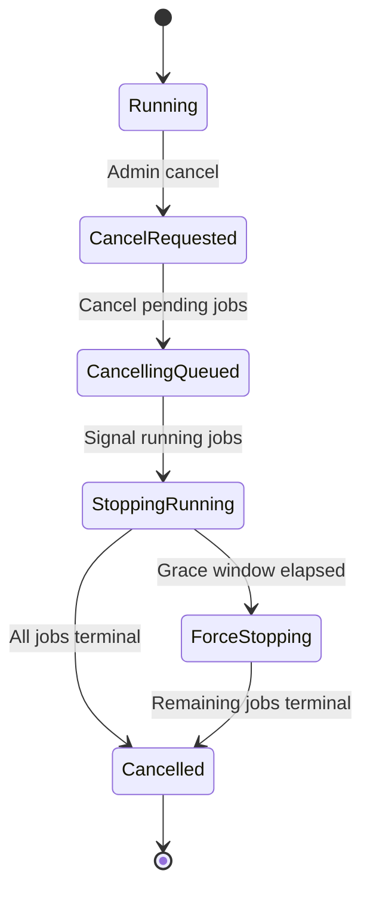
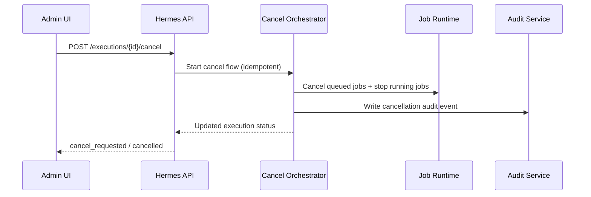

# Hermes admin execution cancellation

**Version:** 1.0 | **Date:** 2026-04-18 | **Owner:** Hermes platform + admin team

## Changelog

- 1.0 (2026-04-18): Initial PRD covering admin-triggered cancellation for schedule, manual, and HTTP executions with cascade cancellation and audit tracking.

## 1. Summary and context

Hermes admins can start executions from multiple trigger paths, but they cannot stop a run once it is active. That creates operational risk when a bad input, misconfigured schedule, or runaway workflow starts producing unwanted jobs.

This initiative adds a first-class "cancel execution" capability in Hermes admin so operators can stop active work quickly and safely. The system must cancel all related queued jobs and stop running jobs using a hybrid stop strategy.

Business and product goals:
- Reduce wasted processing spend from known-bad executions.
- Give operations staff direct control during incidents.
- Improve compliance by recording who canceled what and when.

Non-goals:
- Canceling future executions at the schedule definition level.
- Editing or replaying canceled executions in this release.
- Introducing customer-facing self-service cancellation outside Hermes admin.

## 2. Users and stakeholders

Primary users:
- Hermes admins (and super admins), operating from Hermes admin during normal operations and incident handling.

Stakeholders:
- Platform engineering lead — execution runtime behavior and worker stop semantics.
- Admin app owner — UX, permissions, and operator workflow.
- Security/compliance owner — auditability requirements.
- Support/operations — incident response workflow and success criteria.

How input was gathered:
- Product request from stakeholder prompt plus explicit requirement clarification on cancel semantics, scope, and audit depth.

## 3. User stories and experience

- **[Must]** As an admin, I want to cancel a running execution regardless of whether it was schedule-, manual-, or HTTP-triggered, so I can stop bad runs immediately.
- **[Must]** As an admin, I want queued jobs in that execution to be canceled automatically, so no additional work starts after I cancel.
- **[Must]** As a compliance stakeholder, I want every cancel action audited with actor and context, so we can reconstruct operational decisions.
- **[Should]** As an admin, I want clear status updates while cancellation is in progress, so I know whether the stop succeeded.

Critical user journey:
1. Admin opens an execution with status `running`.
2. Admin clicks `Cancel execution` and confirms.
3. System marks execution as `cancel_requested`.
4. System immediately cancels queued jobs for that execution.
5. Running jobs receive stop signal; if they do not stop in the graceful window, system force-stops where supported.
6. Execution transitions to `cancelled` once all jobs are terminal.
7. Audit event is stored and visible in audit history.

Notable edge cases:
- Admin retries cancel on an already canceling execution (idempotent response, no duplicate effect).
- A job finishes naturally during cancellation (accepted; final status remains terminal and execution still resolves).
- Partial infrastructure failure during cancellation (system records failure details and supports retry without data corruption).

Success metrics:
- >=95% of cancel requests reach terminal `cancelled` (or fully terminalized execution) within 2 minutes.
- 100% of successful cancel actions create one audit event with required fields.
- <1% of canceled executions start new queued jobs after cancel request acceptance.

## 4. Requirements

### Must-have (P0)

- [REQ-001] Hermes admin can cancel any non-terminal execution started by schedule, manual, or HTTP trigger.
  - **Acceptance criteria:**
    - Given an execution in `running` or `queued`, when an admin or super admin requests cancel, then API accepts request and returns `cancel_requested`.
    - Given an execution from each trigger type, when cancel is requested, then behavior is identical across trigger origins.
    - Given a user without admin privileges, when they request cancel, then request is denied with authorization error.

- [REQ-002] Cancellation cascades to all queued/pending jobs belonging to the execution.
  - **Acceptance criteria:**
    - Given an execution with pending jobs, when cancel is accepted, then all pending jobs transition to `cancelled`.
    - Given mixed job states, when cancel is accepted, then no new pending job from that execution is started afterward.
    - Given a pending job canceled by cascade, then job metadata stores cancellation source as `execution_cancel`.

- [REQ-003] Running jobs use hybrid stop semantics (graceful then forced if needed).
  - **Acceptance criteria:**
    - Given a running job that can finish quickly, when cancel is requested, then the job is allowed to finish within graceful window and no new step starts.
    - Given a running job that exceeds graceful window, when timeout is reached, then force-stop is attempted where runtime supports it.
    - Given unsupported hard-stop runtime, when graceful timeout elapses, then job is marked terminal with runtime-specific cancellation reason and execution continues terminalization.

- [REQ-004] Execution status transitions are explicit and idempotent.
  - **Acceptance criteria:**
    - Given a first cancel request, execution transitions `running -> cancel_requested`.
    - Given repeated cancel requests on same execution, API returns current cancellation state and does not duplicate side effects.
    - Given all jobs terminal after cancel flow, execution transitions to `cancelled` with completion timestamp.

- [REQ-005] Audit tracking is recorded for every successful cancel action.
  - **Acceptance criteria:**
    - Given a successful cancel action, one audit entry is persisted containing: actor id, actor role, timestamp, execution id, trigger type.
    - Given audit retrieval for that execution, cancel event is queryable and visible in admin audit view/API.
    - Given cancel failure before acceptance, system records an operational error log (not a successful cancel audit event).

### Should-have (P1)

- [REQ-006] Admin UX shows live cancellation progress and final outcome.
  - **Acceptance criteria:**
    - UI displays `cancel_requested` immediately after acceptance.
    - UI shows counts for terminal and remaining jobs while cancellation is in flight.
    - UI updates to `cancelled` without manual refresh on supported realtime/polling path.

- [REQ-007] Optional cancellation reason can be submitted and stored when provided.
  - **Acceptance criteria:**
    - Reason input is optional in cancel confirmation dialog.
    - If reason is supplied, reason is attached to execution metadata and audit event payload.

### Could-have (P2)

- [REQ-008] Trigger outbound webhook/event to downstream observability tools on execution cancellation.

### Won't (this release)

- Cancel all executions for a schedule in one bulk action.
- Automatic refund/rebilling actions tied to canceled runs.

## 5. Functional specification

- Introduce `cancel execution` command in Hermes admin execution detail and list actions (where non-terminal).
- API validates role (`admin` or `super_admin`) and execution eligibility.
- Execution state model adds or reuses `cancel_requested` intermediate state.
- Cancellation orchestration:
  - Mark execution as `cancel_requested` atomically.
  - Cancel queued jobs immediately.
  - Signal running jobs to stop gracefully.
  - After graceful timeout, force-stop remaining running jobs where supported.
  - Finalize execution as `cancelled` when all jobs become terminal.
- Idempotency:
  - Repeat cancel requests return current cancellation state and metadata.
- Error/empty states:
  - Already terminal execution returns conflict/no-op response with current status.
  - Partial cancellation failure exposes retriable error and keeps consistent state markers.

API and data contracts (high-level):
- `POST /executions/{executionId}/cancel`
  - Request: optional `reason`.
  - Response: execution status snapshot with cancel metadata.
- Audit event type: `execution.cancelled_by_admin` (naming can align with existing convention).

## 6. Non-functional requirements

- Performance: cancel API p95 < 500ms for request acceptance path.
- Reliability: cancellation orchestration must be retry-safe and idempotent.
- Security: enforce role-based authorization and secure audit write path.
- Privacy: audit payload excludes sensitive job input payloads by default.
- Accessibility: admin cancel controls and confirmation modal meet WCAG 2.1 AA keyboard and screen-reader basics.
- Observability: emit structured logs and metrics for cancel requested/succeeded/failed counters and duration.

Constraints:
- Must work with current Hermes execution/job state machine.
- Must not require schedule model redesign in v1.

## 7. Dependencies and risks

Dependencies:
- Runtime worker support for graceful stop and force-stop hooks.
- Execution/job persistence layer supporting atomic status updates.
- Existing audit log service/storage and retrieval surfaces.
- Admin UI permissions model and current auth middleware.

Risks and mitigations:
- Risk: force-stop behavior differs by runtime.
  - Mitigation: define runtime capability matrix and fallback terminal semantics.
- Risk: race conditions between natural job completion and cancel transitions.
  - Mitigation: enforce compare-and-set transitions and idempotent orchestration handlers.
- Risk: missing audit entries under transient failures.
  - Mitigation: transactional write or outbox pattern for accepted cancel events.

## 8. Rollout and flexibility

Rollout plan:
1. Ship backend cancellation API + orchestration behind feature flag `hermes_execution_cancel`.
2. Enable for internal admin users in staging; run incident simulation cases.
3. Enable in production for all admin/super-admin roles after validation.

Migration and rollback:
- No data migration required beyond optional status/audit enum additions.
- Rollback by disabling feature flag; in-flight cancellations continue to terminalize.

Post-v1 flexibility:
- Add bulk schedule-level cancellation.
- Add policy-based required reason for certain environments.
- Extend audit depth to per-job transition trail if compliance asks for stronger traceability.

## 9. Visuals

- Execution cancellation state flow:

Takeaway: cancellation is a staged, idempotent transition rather than a single hard kill.

- Interaction sequence:

Takeaway: audit write is part of successful cancellation flow, not an optional side effect.

## 10. Confirmed decisions and assumptions

- Confirmed: v1 supports all trigger origins (schedule, manual, HTTP).
- Confirmed: cancellation authority is `admin` and `super_admin`.
- Confirmed: pending/queued jobs are always canceled as part of execution cancellation.
- Confirmed: running jobs follow hybrid semantics (graceful first, then force-stop where possible).
- Confirmed: audit baseline includes actor, timestamp, execution id, and trigger type.
- Confirmed: cancellation reason is optional in UX and API request.
