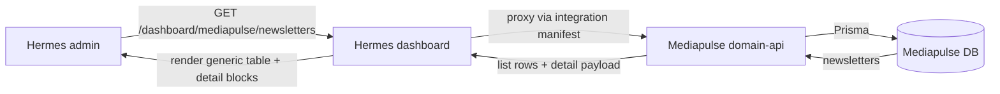
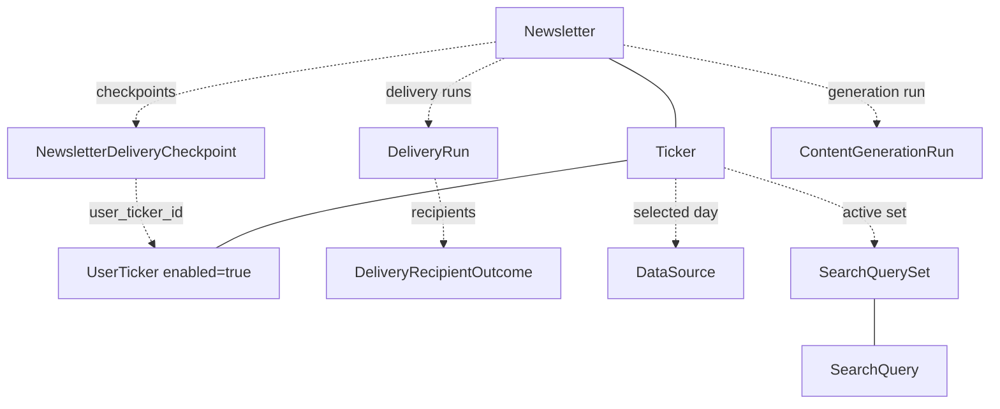

# Hermes admin: newsletter visibility

**Version:** 0.2 | **Date:** 2026-05-14 | **Owner:** Nico (Hermes/Mediapulse)

## Changelog

- 0.2 (2026-05-14): Lock in Path B for the detail page (dedicated Hermes-native route under `/dashboard/mediapulse/newsletters/:id`). Path A removed from the spec.
- 0.1 (2026-05-14): Initial draft. Scope, columns, detail sections, rollout, and success metric confirmed via Q&A.

## Table of contents

1. [Summary and context](#1-summary-and-context)
2. [Users and stakeholders](#2-users-and-stakeholders)
3. [User stories and experience](#3-user-stories-and-experience)
4. [Requirements](#4-requirements)
5. [Functional specification](#5-functional-specification)
6. [Non-functional requirements](#6-non-functional-requirements)
7. [Dependencies and risks](#7-dependencies-and-risks)
8. [Rollout and flexibility](#8-rollout-and-flexibility)
9. [Visuals](#9-visuals)
10. [Confirmed decisions and assumptions](#10-confirmed-decisions-and-assumptions)

## 1. Summary and context

Today a Hermes admin cannot read a generated newsletter in the dashboard. The closest views answer adjacent questions: `/dashboard/agents/content-generation-runs` shows generation-run diagnostics (outcome, stage, error code, duration, a copy-to-clipboard `newsletterId` with no link target), and `/dashboard/mediapulse/delivery-runs` shows per-run send aggregates and a per-recipient JSON blob. Neither view shows the newsletter's subject, body, citations, the sources it pulled from, the search queries that drove data collection, or which enabled subscribers actually received it.

When a subscriber asks "what did I get this morning?" or "did my newsletter go out?", an admin currently has to stitch together at least three views plus a SQL session against the Mediapulse DB. That's slow and error-prone.

The goal is one place in the Hermes admin to answer "what went out, to whom, with which sources, on which Hermes execution?" in under 30 seconds.

Out of scope for v1:

- Read-only only. No resend, no delete, no manual trigger from this surface.
- No open/click/bounce tracking (Resend webhooks are not wired up yet).
- No newsletter editing or content moderation.
- No analytics dashboards (open rates, engagement). That belongs in a separate product surface.
- No cross-ticker batch view; recipient counts are per-newsletter, not per-day.

## 2. Users and stakeholders

**Primary user:** Hermes admin operating the daily Mediapulse pipeline. They authenticate against the existing Hermes admin auth and already have access to every other `/dashboard` route. Typical session is a morning ops review (did last night's 20:00 Asia/Jakarta run complete cleanly?) and ad-hoc triage when a subscriber reports a problem.

**Stakeholders:**

- Hermes admin (primary user, daily): decision authority on UX and which fields are required.
- Mediapulse delivery agent owner: needs the page to show enough recipient detail to confirm send results without grepping `DeliveryRun.recipientErrorSummary`.
- Mediapulse content-generation agent owner: needs the page to show provenance fields (`model`, `configVersion`, `promptHash`, tokens) so an admin can correlate a "bad" newsletter to a config change.
- Hermes orchestration owner: needs deep links to the schedule/pipeline that triggered the run so admins jump from "this newsletter" to "this Hermes execution" without a copy-paste round-trip.

Input gathered: review of existing dashboard pages, the `content-generation-runs` diagnostics docs (which explicitly note "no newsletter detail route exists yet"), and a working session that produced the answers in §10.

## 3. User stories and experience

User stories (priority in brackets):

- **[Must]** As a Hermes admin, I want to see the list of generated newsletters sorted newest-first, so I can confirm last night's run produced one per subscribed ticker.
- **[Must]** As a Hermes admin, I want to search by subject and filter by ticker and date range, so I can find a specific newsletter without scrolling.
- **[Must]** As a Hermes admin, I want to open a single newsletter and read its subject, body, and citations, so I can answer "what did the user actually get?".
- **[Must]** As a Hermes admin, I want to see who was supposed to receive a newsletter and whether each enabled subscriber was delivered, failed, or skipped, with the Resend email id and error category where applicable, so I can triage subscriber reports.
- **[Must]** As a Hermes admin, I want a per-newsletter delivery summary in the list (delivered / enabled subscribers at send time), so the list itself surfaces partial-failure rows without a click.
- **[Should]** As a Hermes admin, I want a rendered email preview using the production template, so I can see exactly what the subscriber saw (subject treatment, links, ticker branding).
- **[Should]** As a Hermes admin, I want to see the `SearchQueries` and `DataSources` that fed this newsletter, so I can debug "why didn't story X make it in?".
- **[Should]** As a Hermes admin, I want deep links from the newsletter to the Hermes `ScheduleExecution` and pipeline step that triggered the run, so I can pivot to orchestration without copying ids around.
- **[Could]** As a Hermes admin, I want to copy the raw markdown body and the newsletter id, so I can paste them into tickets and Slack.
- **[Won't, v1]** Resend, delete, or "force re-deliver" actions.
- **[Won't, v1]** Open/click rates.

Critical user journey:

1. Admin opens `/dashboard/mediapulse/newsletters` after the daily 20:00 Asia/Jakarta run.
2. The list shows one row per ticker generated last night, with delivery summary like `12 / 12`, `0 / 12`, or `11 / 12`. Anything below 100% stands out.
3. Admin clicks an `11 / 12` row to open the detail page.
4. The metadata header shows ticker, subject, created at, model, config version, prompt hash, total tokens.
5. The recipients section shows one row per enabled `UserTicker` at the time the delivery agent ran, with status (delivered, failed, skipped, not_attempted), Resend email id, attempts, and error category.
6. Admin clicks the failed recipient, copies the error category and Resend email id, and pivots to the linked Hermes `ScheduleExecution` to see the surrounding pipeline run.

Success metric (primary, v1): **time-to-diagnose** for a single subscriber report. Target: an admin answers "what went out, to whom, with which sources, on which Hermes execution?" from this page alone in under 30 seconds, with no SQL session and no jumping between three dashboard routes. Measured qualitatively by Hermes admin self-report over the first two weeks; we can add a tracked event later if needed.

## 4. Requirements

REQ-001 through REQ-006 are P0 (must). REQ-007 through REQ-013 are P1 (should). REQ-014 through REQ-015 are P2 (could). Won't items are listed at the bottom.

### Must-have (P0)

- **[REQ-001]** Register a new `newsletters` resource in `apps/mediapulse/domain-api/src/resources/newsletters/` (definition, dashboard-page manifest, routes, list-mapper) so the Hermes dashboard auto-renders `/dashboard/mediapulse/newsletters` via the existing `table-v1` integration manifest. Read-only (`actions: { view: true }`).
  - **Acceptance criteria:**
    - The route appears in the Hermes sidebar under the Mediapulse section.
    - The route returns paginated results via the same `ListPagination` used by delivery-runs.
    - No CRUD endpoints (create/update/delete) are wired up.

- **[REQ-002]** List page columns: Ticker (symbol + name), Subject (truncated to one line), Created at (local time + ISO tooltip), Delivery summary (`delivered / enabled at send time`).
  - **Acceptance criteria:**
    - "Delivered" = count of `NewsletterDeliveryCheckpoint` rows for that `newsletterId`.
    - "Enabled at send time" = count taken from the latest `DeliveryRun` for that newsletter when one exists (`successCount + failureCount + skippedCount`); falls back to current enabled `UserTicker` count for that ticker when no `DeliveryRun` exists yet, with a "(no run yet)" hint in the cell.
    - Rows with `delivered < enabled` render the count in a `warning` badge style; `0 / N` renders in `destructive`.

- **[REQ-003]** List page filters and search: filter by ticker (typeahead on symbol or id), filter by `createdAt` date range (two date inputs, inclusive), search by subject (case-insensitive substring), default sort `createdAt DESC`. All state is in URL search params and survives reloads and back/forward.
  - **Acceptance criteria:**
    - Clear-filter affordance for each control.
    - URL contains `q`, `ticker`, `from`, `to`, `page`, `size`, `sort`, `dir`.
    - Empty state copy when no newsletters match.

- **[REQ-004]** Detail page renders, in this order: metadata header → tabs or sections for Body (markdown) | Email preview | Recipients | Sources | Queries | Hermes links. Implementation may use a single scrollable page with section headings rather than tabs if simpler; either is acceptable.
  - **Acceptance criteria:**
    - Page loads in under 1.5s for newsletters with up to 500 enabled subscribers and 50 DataSources.
    - All sections are readable on a 1280px-wide viewport without horizontal scroll.

- **[REQ-005]** Metadata header shows: ticker (symbol + name, clickable to `/dashboard/mediapulse/tickers/:id`), subject, created at, `model`, `agentVersion`, `configVersion`, `promptHash` (monospace, copy-to-clipboard), `configSnapshotId`, `promptTokens` / `completionTokens` / `totalTokens`. Null fields render as `—`.
  - **Acceptance criteria:**
    - Copy-to-clipboard buttons on `id`, `promptHash`, `configSnapshotId`.
    - Token fields render as `prompt + completion = total` when all three are set.

- **[REQ-006]** Recipients section shows one row per enabled `UserTicker` for the newsletter's ticker, joined with delivery state. Columns: email (or `name <email>`), status (`delivered` / `failed` / `skipped` / `not_attempted`), Resend email id (truncated, copyable), attempts, error category, last error message (truncated with tooltip), delivered_at.
  - **Acceptance criteria:**
    - Status derivation:
      - `delivered` if a `NewsletterDeliveryCheckpoint` row exists for `(newsletterId, userTickerId)`.
      - Else look up the most recent `DeliveryRecipientOutcome` for `(runId where DeliveryRun.newsletterId = this newsletter, userTickerId)`; use its `status` (`success`/`failed`/`skipped`). Note: `success` here without a checkpoint means delivery agent reported success but did not persist the checkpoint, which is unexpected; render as `delivered` with an "inconsistent" warning icon and tooltip.
      - Else `not_attempted` (no run yet, or recipient was not enabled at run time).
    - Recipients enabled today but who were not in the run that produced this newsletter render as `not_attempted` rather than being omitted.
    - The section header shows the same aggregate as the list cell (`delivered / enabled at send time`).

### Should-have (P1)

- **[REQ-007]** Body section: render `Newsletter.content` as markdown, with `[title](url)` citations as clickable external links opening in a new tab. Long bodies (>10k chars) are clamped at first 4k chars with a "show full body" expander.
  - **Acceptance criteria:**
    - Headings and lists render. The exact same parser as the email template uses (`parseNewsletterBody` from `@workspace/email-templates`) is reused, not a separate one.

- **[REQ-008]** Email preview section: render the production email template (`@workspace/email-templates` → `default-newsletter`) server-side via `@react-email/render`, embed as HTML in an iframe sandboxed with `allow-popups`.
  - **Acceptance criteria:**
    - The preview reflects the same subject and body the subscriber received.
    - Resource paths (logos, assets) load successfully or render with a placeholder; no console errors break the preview.
    - The preview is clearly labeled "Preview of the email template as sent" so an admin understands it is rendered, not retrieved from Resend.

- **[REQ-009]** Citations list: parse `[title](url)` markdown citations from `Newsletter.content` and render as a compact list with title + domain. Each citation links to the URL externally. De-duplicate by URL.
  - **Acceptance criteria:**
    - The parser handles standard markdown link syntax and is tolerant of nested formatting (bold inside link text).
    - Count of distinct citations is shown in the section header.

- **[REQ-010]** Selected sources section: list `DataSource` rows for the newsletter's `tickerId` where `ArticleRelevance.selected = true` and `scoredAt` falls in the same UTC calendar day as `Newsletter.createdAt`. Columns: title, domain, score, scoredAt.
  - **Acceptance criteria:**
    - Matches the current `getDataSourcesForTicker` window logic in `apps/mediapulse/agent-data-api/src/services/content-generation.ts`. If the agent later changes that window, this page changes with it.
    - Each row links to `/dashboard/mediapulse/data-sources/:id` (already exists).
    - Empty state ("No selected sources match the calendar-day window for this newsletter") includes the exact UTC window for transparency.

- **[REQ-011]** Search queries section: list `SearchQuery` rows for the newsletter's `tickerId` that belong to the `SearchQuerySet` active on `Newsletter.createdAt`. Columns: text, intent, source, rank.
  - **Acceptance criteria:**
    - "Active set" = the most recent `SearchQuerySet` with `generatedAt <= Newsletter.createdAt` and `isActive = true` for that ticker; if none, show empty state.
    - Each row links to `/dashboard/mediapulse/search-queries?tickerId=…` filtered to that ticker.
    - The section header shows the active set's `generatedAt` and `generationSource` so an admin can spot that the queries came from yesterday's set, not last week's.

- **[REQ-012]** Hermes execution links: read the `ContentGenerationRun` row whose `newsletterId` equals this newsletter, and the latest `DeliveryRun` row for the same newsletter. From those rows, surface deep links: `hermesScheduleId` → `/dashboard/schedules/:id`, `scheduleExecutionId` → `/dashboard/schedules/:id` (anchor to the run if supported), `pipelineStepId` → `/dashboard/pipelines/...`, `jobId` → copyable text (no destination today).
  - **Acceptance criteria:**
    - Section renders only the ids present on those rows. Missing ids render as `—`.
    - This does not show full run cards; an admin who wants the diagnostics is expected to click into Hermes or open `/dashboard/agents/content-generation-runs` for that ticker.

- **[REQ-013]** Empty state and error state for the detail page: a newsletter id that doesn't exist returns the standard Hermes 404. A newsletter that exists but has no `ContentGenerationRun` row (data anomaly) renders the body and recipients normally, and shows a single "no generation run recorded" hint in the Hermes execution links section.
  - **Acceptance criteria:**
    - 404 is the same `notFound()` pattern used elsewhere in the dashboard.

### Could-have (P2)

- **[REQ-014]** Copy helpers on the detail page: copy newsletter id, copy markdown body, copy Resend email id from any recipient row, copy ticker symbol. These reuse the same copy-to-clipboard button used in CGA diagnostics detail.

- **[REQ-015]** Per-section visual badges: warning badge on the section header for Recipients when `delivered < enabled at send time`, neutral badge on Sources when count is `0`, neutral badge on Queries when the active set is older than 24 hours from `Newsletter.createdAt`.

### Won't (this release)

- Resend or delete actions.
- Open / click / bounce tracking.
- Cross-ticker daily summary ("last night's run") view.
- Server-sent updates / live refresh; an admin presses refresh.
- Exporting CSV / JSON.
- Search across newsletter body content (only subject is searchable).
- Feature-flag gating. The user opted to ship without a flag (see §10).

## 5. Functional specification

### Where the data is read

The list and the detail are served by `apps/mediapulse/domain-api`, not by `agent-data-api`. The Hermes dashboard reaches them through the same `table-v1` integration manifest already used by `delivery-runs` and `data-sources`.

Why not `agent-data-api`: the `agent-data-api` exists for agent-to-DB traffic and has no `newsletters` namespace today. The admin dashboard reads through `domain-api` (which already lives in the Mediapulse app and owns its Prisma access). Adding the resource there is the lowest-friction path and matches the conventions documented in `dev-docs/docs/mediapulse/apps/domain-api.mdx`.

### List endpoint

Path on `domain-api`: `GET /resources/newsletters` (list), `GET /resources/newsletters/meta`, `GET /resources/newsletters/:id`.

Query params on list:

- `page` (1-based), `size` (default 15, max 100)
- `q` (subject substring)
- `ticker` (ticker id; meta endpoint returns options for the dropdown)
- `from`, `to` (ISO date, inclusive)
- `sort` (createdAt only for v1), `dir` (`asc` | `desc`)

Server-side response shape conforms to the existing `table-v1` list item contract (`apps/mediapulse/domain-api/src/resources/delivery-runs/list-mapper.ts` is the reference). Each row carries:

```
{
  id: string,                       // newsletter.id
  tickerSymbol: string,
  tickerName: string,
  subject: string,
  createdAt: string,                // ISO
  deliveryDelivered: number,        // checkpoint count
  deliveryEnabledAtSendTime: number,// from DeliveryRun aggregates or current enabled count
  deliveryHasRun: boolean,
}
```

The list query uses Prisma typed args (`Prisma.NewsletterFindManyArgs`), joining `_count` for delivery checkpoints and looking up the latest `DeliveryRun` per newsletter in a single follow-up query keyed by `newsletterId in (...)`. Don't N+1; batch by id.

### Detail endpoint

`GET /resources/newsletters/:id` returns the newsletter plus everything the detail page needs in one round-trip:

```
{
  newsletter: {
    id, subject, description, content, tickerId, createdAt,
    model, agentVersion, configVersion, promptHash, configSnapshotId,
    promptTokens, completionTokens, totalTokens,
    ticker: { id, symbol, name },
  },
  recipients: Array<{
    userTickerId, userEmail, userName,
    status: "delivered" | "failed" | "skipped" | "not_attempted",
    resendEmailId: string | null,
    attempts: number,
    errorCategory: string | null,
    lastErrorMessage: string | null,
    deliveredAt: string | null,
  }>,
  selectedSources: Array<{ id, title, url, score, scoredAt }>,
  activeQuerySet: {
    setId: string | null,
    generatedAt: string | null,
    generationSource: string | null,
    queries: Array<{ id, text, intent, source, rank }>,
  } | null,
  hermesLinks: {
    contentGenerationRunId: string | null,
    deliveryRunIds: string[],
    hermesScheduleId: string | null,
    scheduleExecutionId: string | null,
    hermesExecutionId: string | null,
    pipelineStepId: string | null,
    jobIds: string[],
  },
}
```

Read order for the detail handler:

1. `prisma.newsletter.findUniqueOrThrow({ where: { id }, include: { ticker: true } })`.
2. Enabled `UserTicker` rows for `newsletter.tickerId` (`enabled: true`), each with `MediapulseUser`.
3. `NewsletterDeliveryCheckpoint.findMany({ where: { newsletterId } })`.
4. `DeliveryRun.findMany({ where: { newsletterId }, include: { recipients: true }, orderBy: { createdAt: "desc" } })`.
5. Selected `DataSource` rows (UTC day window described in REQ-010).
6. Active `SearchQuerySet` and its `SearchQuery` rows (REQ-011).
7. `ContentGenerationRun.findFirst({ where: { newsletterId } })` for Hermes correlation ids.

Recipient status derivation runs in the handler (REQ-006). Keep the algorithm in a small pure function with its own unit tests, so the rule "checkpoint wins; otherwise latest DeliveryRecipientOutcome; otherwise not_attempted" is exercised against representative fixtures.

### Detail page rendering

The list page works out of the box on the generic `table-v1` contract. The detail page does **not** fit the generic key/value renderer in `apps/hermes/dashboard/app/dashboard/[integrationId]/[resource]/[itemId]/page.tsx` because it needs a markdown body, an iframe email preview, and multiple structured sub-tables.

**Approach: dedicated Hermes-native detail route.** Register the list as a generic `table-v1` resource as described above, but **shadow** the generic detail route with a Hermes-native page at `apps/hermes/dashboard/app/dashboard/mediapulse/newsletters/[id]/page.tsx`. The Next.js router resolves the more specific path before the catch-all `[integrationId]/[resource]/[itemId]` route, so the bespoke page wins for newsletters without changing routing for any other resource.

This page:

- Reads the detail payload (§5) by calling the `domain-api` detail endpoint through the same auth/proxy used by other dashboard routes. Do **not** call `@mediapulse/database` from `apps/hermes/dashboard` directly — that boundary is documented in `dev-docs/docs/integration/domains.mdx`.
- Renders the layout described in §9: metadata header, markdown body (reusing `parseNewsletterBody` from `@workspace/email-templates`), rendered email preview in a sandboxed iframe, citations list, selected sources sub-table, search queries sub-table, recipients sub-table, Hermes execution links block.
- Reuses existing components from `apps/hermes/dashboard/components/`: `PageHeader`, copy-to-clipboard button used in `content-generation-run-detail.tsx`, sub-table primitives used by the variables/agents list pages where they fit.
- Does **not** require any change to the `table-v1` manifest contract.

The list row's "View" action and the breadcrumb link target this bespoke detail path; the integration manifest's default `view` action URL is overridden at registration time (`actions: { view: { hrefTemplate: "/dashboard/mediapulse/newsletters/{id}" } }`, matching the override pattern already used by other resources). If the manifest doesn't support a per-resource href override today, that one-line addition is the prerequisite for the list PR.

### Components reused (not rewritten)

- `ListPagination` (`apps/hermes/dashboard/components/list-pagination.tsx`).
- `PageHeader` (`apps/hermes/dashboard/components/page-header.tsx`).
- `AgentRunOutcomeBadge` only for runs links section if we surface outcome (we mostly link out).
- Copy-to-clipboard button used by `content-generation-run-detail.tsx`.
- The Markdown rendering pipeline used by `@workspace/email-templates` (don't add a second one).

## 6. Non-functional requirements

- **Performance:** list page p95 under 600ms for queries on a 30-day window and up to 5,000 newsletters; detail page p95 under 1.5s for up to 500 recipients and 50 sources. List queries must avoid N+1 on delivery aggregates (batch by `newsletterId in (...)`).
- **Auth:** the page sits behind the existing Hermes admin session (`withAuthProtection`). No new role.
- **Privacy:** subscriber emails are PII. The Hermes dashboard already handles `MediapulseUser` rows; treat this no differently. Don't log full emails server-side; the detail handler logs `userTickerId` only.
- **Observability:** detail-endpoint errors log the newsletter id and the failing read step. The recipient-status derivation function emits a structured debug log when it falls back to `not_attempted` for an enabled subscriber that wasn't in the run (this is a real anomaly worth seeing).
- **Accessibility:** all interactive cells reachable by keyboard; table headers have `aria-sort`; status badges have text labels in addition to color.
- **Browser support:** matches the rest of the Hermes dashboard; latest two versions of Chrome/Edge/Firefox/Safari.
- **Tests:** unit tests on the recipient-status function, the list query builder, and the detail aggregator. Coverage target consistent with the workspace standard (`typescript-javascript-standards`). React components: smoke tests at minimum on the recipients table (status mapping) and the email-preview iframe (renders without throwing).

## 7. Dependencies and risks

Dependencies:

- `apps/mediapulse/domain-api` resource registry (`hermes-dashboard-resource-registry.ts`).
- `@workspace/email-templates` `default-newsletter` and `parseNewsletterBody`.
- `@react-email/render` (already a dependency of `email-templates`).
- Prisma models already in place (`Newsletter`, `Ticker`, `UserTicker`, `NewsletterDeliveryCheckpoint`, `DeliveryRun`, `DeliveryRecipientOutcome`, `SearchQuery`, `SearchQuerySet`, `DataSource`, `ArticleRelevance`, `ContentGenerationRun`). No schema changes required for v1.

Risks and mitigations:

- **Detail rendering doesn't fit the generic `table-v1` contract.** Mitigation: ship a dedicated Hermes-native detail route at `/dashboard/mediapulse/newsletters/[id]/page.tsx` that shadows the generic route (§5). No manifest contract changes required, beyond confirming the manifest supports a per-resource `view` href override (one-line addition if not).
- **Recipient status can drift from reality** if `DeliveryRun.recipients` and `NewsletterDeliveryCheckpoint` disagree. Mitigation: REQ-006 spells out the precedence rule and surfaces inconsistencies with an "inconsistent" tag so admins see, rather than hide, the anomaly.
- **"Selected sources" join is a heuristic.** There is no FK from `Newsletter` to `DataSource`. The UTC-day window matches the current agent behavior but will drift if the agent changes its window. Mitigation: section header shows the exact window used; if the agent changes, the dashboard query changes with it. Don't fake a tighter relationship than the data supports.
- **"Active SearchQuerySet" is also a heuristic.** Similar story; section header shows the set's `generatedAt`.
- **Email preview can look wrong** if the template references assets that aren't reachable from the dashboard host. Mitigation: render in a sandboxed iframe so a broken asset doesn't break the page; clearly label the section as "preview" rather than "what we sent".
- **List page can get slow at scale** as Newsletter and DeliveryRun rows grow. Mitigation: indexes on `Newsletter.tickerId` and `Newsletter.createdAt` already exist; add a covering index later if the p95 budget is missed. Out of scope for v1.
- **No feature flag.** The user opted out of flagging. Mitigation: ship as stacked PRs so each layer can be reverted independently, and land the data layer (resource + detail endpoint) before the UI layer so the UI never references a missing handler. See §8.

## 8. Rollout and flexibility

Shipping order (stacked PRs, no feature flag):

1. **Domain-api `newsletters` resource — list shape only.** Resource definition, list-mapper, list route, `meta` route. Override the list row's `view` action href to point at `/dashboard/mediapulse/newsletters/{id}` so the future bespoke detail route is wired up from day one. If the manifest doesn't support a per-resource href override yet, add it here (one-line). The list page is reachable as soon as this lands.
2. **Domain-api detail endpoint.** Returns the full payload in §5 (`newsletter`, `recipients`, `selectedSources`, `activeQuerySet`, `hermesLinks`). Until the bespoke route in step 3 lands, the "View" link 404s; admins can still consume the list. Reviewers can hit the endpoint directly to validate the shape.
3. **Bespoke detail route.** `apps/hermes/dashboard/app/dashboard/mediapulse/newsletters/[id]/page.tsx`. Renders metadata header, markdown body, sandboxed email preview, citations list, selected sources, search queries, recipients table, Hermes execution links.
4. **Polish:** copy helpers (REQ-014), per-section badges (REQ-015), empty-state strings, accessibility pass.

Each PR is independently revertable. Steps 1 and 2 are decoupled (the list works without the detail endpoint, and the detail endpoint can be validated independently of the UI).

Post-v1 candidates (not committed):

- A "last night's run" cross-ticker summary that groups newsletters by `createdAt` UTC date and shows aggregate delivery health.
- Wire Resend webhooks so the recipients table can show `opened`, `clicked`, `bounced`.
- Resend-to-one-recipient action (would route through the delivery agent's existing send flow).
- Cross-link the CGA diagnostics detail page's `newsletterId` value to `/dashboard/mediapulse/newsletters/:id` so the "no newsletter detail route exists yet" caveat in the docs goes away.

## 9. Visuals

### List page wireframe (described)

```
PageHeader: "Newsletters" — "Generated newsletters across all tickers."

[Search subject ............]  [Ticker ▾]  [From _____] [To _____]   (Clear)

| Ticker          | Subject                                | Created at       | Delivery   |
|-----------------|----------------------------------------|------------------|------------|
| AAPL  Apple Inc | "Apple's earnings beat, Vision Pro …"  | May 14 20:01     | 12 / 12    |
| TSLA  Tesla     | "Tesla price cut hits margins …"       | May 14 20:01     | 11 / 12  ! |
| NVDA  Nvidia    | "NVDA: data-center revenue surges …"   | May 14 20:00     | 0 / 14  !! |
| ...                                                                              |

ListPagination ◀ 1 of 7 ▶
```

### Detail page wireframe (described)

```
PageHeader: "Apple's earnings beat …" — "AAPL — May 14 2026 20:01"

Metadata
  Ticker       AAPL (Apple Inc)
  Model        gpt-4o-mini          Agent ver  1.2.3
  Config ver   2026-05-10-rev3      Prompt hash  ab12cd34… [copy]
  Tokens       2,431 prompt + 814 completion = 3,245 total

Body (markdown)
  [rendered markdown of newsletter.content with clickable citations]

Email preview
  [sandboxed iframe rendering of default-newsletter template]

Citations (8 unique)
  · "Apple Q2 earnings beat" — bloomberg.com
  · "Vision Pro shipments slip" — wsj.com
  · ...

Selected sources (window: 2026-05-14 UTC)
  | Title                           | Domain        | Score | Scored at        |
  | ...                                                                          |

Search queries (active set generated 2026-05-14 05:00, source: llm)
  | Text                            | Intent     | Source | Rank |
  | ...                                                                |

Recipients (delivered 11 / 12 enabled at send time)
  | Email            | Status     | Resend id     | Attempts | Error          | Delivered at  |
  | a@x.com          | delivered  | re_abc…       | 1        | —              | 20:01:14      |
  | b@x.com          | failed     | re_def…       | 3        | bounce.hard    | —             |
  | ...                                                                                          |

Hermes execution
  ContentGenerationRun  cgr_…  [copy]
  DeliveryRun(s)        dr_…   [copy]
  Schedule              → /dashboard/schedules/sch_…
  Schedule execution    → /dashboard/schedules/sch_…#exec_…
  Pipeline step         → /dashboard/pipelines/…
  Job id                job_…  [copy]
```

### Data flow





## 10. Confirmed decisions and assumptions

- **UI pattern:** generic `table-v1` resource registered in `apps/mediapulse/domain-api` for the **list**, plus a **bespoke Hermes-native detail route** at `apps/hermes/dashboard/app/dashboard/mediapulse/newsletters/[id]/page.tsx` that shadows the generic detail route. The user chose Path B (dedicated detail route) over Path A (extending the `table-v1` manifest with new block types).
- **Detail sections to include:** metadata header, body markdown, email preview (rendered from `@workspace/email-templates`), citations list, selected sources, search queries, recipients table, Hermes execution links. A separate "linked runs" panel showing full `ContentGenerationRun` / `DeliveryRun` cards was explicitly **not** selected; admins jump to `/dashboard/agents/content-generation-runs` or `/dashboard/mediapulse/delivery-runs` for that.
- **List columns and filters:** ticker, subject, created at, delivery summary; filters for ticker and date range; search by subject; default sort newest first. Token totals are **not** shown on the list (only on the detail). A delivery-outcome filter is **not** included in v1.
- **Actions:** read-only. No resend, no delete, no copy helpers in the base scope (copy helpers are REQ-014, P2).
- **Rollout:** no feature flag. Shipping as stacked PRs (data resource → detail endpoint → detail UI → polish).
- **Success metric:** time-to-diagnose under 30 seconds, measured qualitatively by admin self-report in the first two weeks.
- **Assumption (engineer to validate, low risk):** Next.js App Router resolves `/dashboard/mediapulse/newsletters/[id]/page.tsx` ahead of the catch-all `/dashboard/[integrationId]/[resource]/[itemId]/page.tsx` for the same URL. This is the standard App Router behavior (more specific segments win); verify with a smoke test in step 3 of §8.
- **Assumption:** the integration manifest supports a per-resource `view` action href override (or the addition is one line). If neither is true, treat that as a prerequisite of step 1 in §8 rather than as a blocker.
- **Assumption:** the "selected sources" UTC-day window matches `getDataSourcesForTicker` in `apps/mediapulse/agent-data-api/src/services/content-generation.ts` as of writing. If the agent changes that window, this page changes with it. The section header always shows the exact window used.
- **Assumption:** the "active `SearchQuerySet`" for a newsletter is the most recent `SearchQuerySet` with `isActive = true` and `generatedAt <= Newsletter.createdAt` for the same ticker. If none, the section renders empty.
- **Assumption:** "delivered" is the `NewsletterDeliveryCheckpoint` count, not the `DeliveryRun.successCount`. The two should agree; when they don't, the dashboard surfaces the disagreement (REQ-006).

---

## Rubric self-score

| Criterion                  | Max     | Score  | Notes                                                                                                                                              |
| -------------------------- | ------- | ------ | -------------------------------------------------------------------------------------------------------------------------------------------------- |
| 1. Clarity                 | 10      | 9      | Plain language, short sentences, jargon defined inline (e.g. "active SearchQuerySet").                                                             |
| 2. Comprehensiveness       | 15      | 14     | Problem, goals, scope, non-goals, users, flows, data shape, integrations, constraints, risks, rollout, decisions covered. No `[TBD]` placeholders. |
| 3. Structure & org         | 10      | 10     | Numbered sections matching template, TOC, scannable bullets.                                                                                       |
| 4. Prioritization          | 10      | 10     | P0/P1/P2 + Won't, dependencies in §8.                                                                                                              |
| 5. Testability             | 10      | 9      | Every REQ has acceptance criteria. Some are qualitative (success metric); explicitly called out.                                                   |
| 6. Stakeholder involvement | 10      | 8      | Roles named (Hermes admin, delivery agent owner, CG agent owner, orchestration owner); no individual sign-offs yet.                                |
| 7. User-centric focus      | 15      | 13     | Stories with priority, journey, success measured from the admin's view (30-second triage).                                                         |
| 8. Visual aids             | 5       | 4      | Wireframes (ascii) + Mermaid data flow + ER. Could be tightened.                                                                                   |
| 9. Flexibility             | 5       | 5      | Detail route decision locked (Path B); post-v1 candidates listed.                                                                                  |
| 10. Version control        | 5       | 5      | Version, date, owner, changelog.                                                                                                                   |
| **Total**                  | **100** | **89** | Band: Good.                                                                                                                                        |

To get above 90: add named individual sign-offs in §2 once stakeholders confirm, and replace the ascii wireframes with linked Figma frames when available.
