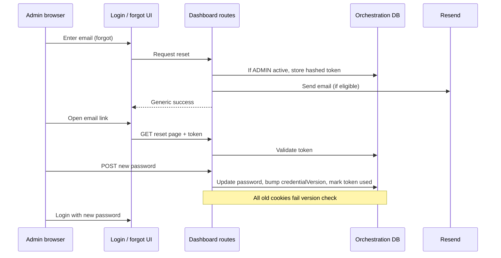

# Hermes admin self-service password reset (logged out)

**Version:** 1.0 | **Date:** 2026-04-06 | **Owner:** Hermes platform / product (TBD)

## Changelog

- 1.0 (2026-04-06): Initial PRD for forgot-password and reset flows, Resend email, anti-enumeration UX, and global session invalidation after reset.

## 1. Summary and context

### Problem statement (why now)

Hermes dashboard admins authenticate with email and password. If an admin forgets their password or is locked out, they cannot regain access without another privileged admin resetting their password from inside the dashboard (`Reset password` on the admins list). That creates an operational bottleneck and a single point of failure when no other admin is available.

Today, **password reset for admins exists only for logged-in Hermes admin managers** targeting another user. There is **no self-service path on the login page** for an admin who is not authenticated.

### Business / product goals (outcomes, not features)

- Reduce support burden and lockout risk for Hermes operators.
- Restore admin access without requiring a second human in the loop for routine password loss.
- Keep the flow aligned with security expectations for a privileged console (rate limits, short-lived tokens, no account enumeration).

### Non-goals

- Password recovery for non-`ADMIN` Hermes users or for Mediapulse product users (unless explicitly merged later).
- SMS or non-email channels in v1.
- Self-service **username** recovery beyond what is implied by email-based identity (email remains the identifier).
- Changing the existing **admin-to-admin** reset behavior except where shared code paths (e.g. password hashing, session invalidation) should stay consistent.

## 2. Users and stakeholders

### Primary personas

- **Locked-out Hermes admin:** Needs to complete critical work in the Hermes dashboard; forgot password or password manager mismatch; no other admin available to reset them.
- **Security / infra:** Cares about abuse resistance, auditability, and not leaking which emails are registered.

### Stakeholders

| Role / group        | Interest                                 | Decision authority                 |
| ------------------- | ---------------------------------------- | ---------------------------------- |
| Hermes engineering  | Implementation, env vars, DB migrations  | Delivery                           |
| Security / platform | Threat model, rate limits, token storage | Approve security-sensitive choices |
| Product / ops       | UX copy, support runbook                 | Approve user-facing messaging      |

### How input was gathered

- Codebase review: login uses email/password + bcrypt; dashboard session is cookie-based; admin reset today requires `requireHermesAdminManagementActor` and a live session.
- Interactive clarification with product owner (2026-04-06): delivery channel, enumeration policy, session invalidation scope.

## 3. User stories and experience

### User stories (priority)

| Priority   | Story                                                                                                                                                                                     |
| ---------- | ----------------------------------------------------------------------------------------------------------------------------------------------------------------------------------------- |
| **Must**   | As a Hermes admin who is logged out, I want to request a password reset link sent to my email so that I can regain access without another admin.                                          |
| **Must**   | As a Hermes admin, I want the application to avoid revealing whether my email is registered when I request a reset, so that attackers cannot enumerate accounts.                          |
| **Must**   | As a Hermes admin, after I set a new password via the reset link, I want all of my existing dashboard sessions to stop working so that a stolen session cannot outlive a password change. |
| **Should** | As ops, I want rate limits and clear logs on reset requests and completions so we can detect abuse without storing unnecessary PII.                                                       |
| **Could**  | As an admin, I want the reset email and pages to match Hermes dashboard branding (consistent with other emails once templates exist).                                                     |

### Critical user journeys

1. **Happy path — request:** Login page → “Forgot password?” → enter email → submit → generic success message → email arrives with link → open link → set new password (with confirmation) → redirect to login → sign in with new password.
2. **Edge — unknown or non-admin email:** Same generic success message; no email sent (or silently no-op server-side); no different UI text.
3. **Edge — inactive admin or non-admin email:** Same as above; no reset email for ineligible accounts.
4. **Edge — expired or reused token:** Show clear error; offer to request a new link.
5. **Edge — abuse:** IP/email rate limited; user sees non-leaky error or retry-after messaging as appropriate.

### Success metrics

- **User-facing:** Reduction in tickets or manual “admin reset my password” escalations (baseline TBD); qualitative feedback from operators.
- **Technical:** Successful reset completions without credential-related security incidents; monitoring for spikes in failed/expired token use.

## 4. Requirements

### Must-have (P0)

- **[REQ-001] Forgot-password entry point (logged out)**
  - **Acceptance criteria:** From `/login`, an unauthenticated user can navigate to a dedicated forgot-password screen; form collects email; submit triggers server-side processing; UI shows the **same success message** whether or not a reset email was sent (anti-enumeration). Accessible labels and keyboard flow match existing login patterns.

- **[REQ-002] Email delivery via Resend**
  - **Acceptance criteria:** Reset emails are sent through **Resend**, consistent with other apps in the monorepo. Sender/from address and reply-to are configured via typed env (`@hermes/env` pattern). Failures are logged; the user still sees the generic success message from [REQ-001].

- **[REQ-003] Secure reset token lifecycle**
  - **Acceptance criteria:** Reset links are single-use (or explicitly documented if multi-tap is allowed—default **single-use**), cryptographically random, stored hashed at rest, bound to user id, with a short TTL (recommend **≤ 1 hour**, final value in implementation). Expired or invalid tokens show a safe error and CTA to request a new link.

- **[REQ-004] Set new password**
  - **Acceptance criteria:** Valid token allows setting a new password meeting the same minimum rules as login/admin reset today (minimum length aligned with existing `z.string().min(4)` or stricter if product updates globally—document in release notes). Password is stored with existing bcrypt cost pattern. Successful completion clears the reset token so it cannot be reused.

- **[REQ-005] Invalidate all dashboard sessions for that user on password change**
  - **Acceptance criteria:** After a successful self-service reset, **any prior Hermes dashboard session** for that user is rejected on next request (see §5: credential version or equivalent). The same invalidation applies when an admin changes another admin’s password via the existing dashboard flow, so behavior stays consistent.

### Should-have (P1)

- **[REQ-006] Rate limiting**
  - **Acceptance criteria:** Forgot-password submissions are rate-limited per IP and/or per email bucket; limits documented for ops; 429 or throttling behavior does not leak enumeration.

- **[REQ-007] Observability**
  - **Acceptance criteria:** Structured logs for request received, email send result (success/failure without body), token validation failure reason category, reset success—without logging reset tokens or plaintext passwords.

### Could-have (P2)

- **[REQ-008] Email template polish**
  - **Acceptance criteria:** HTML/plaintext email uses shared email template conventions if/when `@workspace/email-templates` is used for Hermes.

### Won’t (this release)

- SMS MFA or backup codes as part of this feature.
- Account unlock separate from password (unless same flow covers it by policy).

## 5. Functional specification

### Current system (baseline)

- **Login:** `POST` login action validates `User` by email, `role === ADMIN`, `isActive`, bcrypt password, then sets `auth-token` and `auth-user` cookies (`apps/hermes/dashboard/app/login/action/route.post.config.ts`).
- **Admin reset (logged in):** Another admin with management rights sets `newPassword` for a target admin (`apps/hermes/dashboard/app/dashboard/admins/actions/reset-password/route.post.config.ts`); **no** self-service.

### Proposed additions

1. **Forgot-password route(s):** Accept email; if eligible (active `ADMIN`), create reset token record and enqueue/send email; always return generic response to client.
2. **Reset-password page (logged out):** Read token from query (prefer opaque token id in URL vs raw secret in path—implementation detail); validate; show form for new password + confirm.
3. **Data model:** New table or fields for password-reset tokens (hashed token, `userId`, `expiresAt`, `usedAt` nullable). Prisma migration via project conventions.
4. **Session invalidation mechanism:** Today, `resolveHermesActiveAdminDashboardAccess` checks user id/role/active in DB but **does not** tie cookies to a server-side session record. To meet “invalidate all sessions,” implement a **credential revision** checked on each dashboard access, for example:
   - Add `credentialVersion` (integer, default 0) on `User` (or reuse a timestamp field); increment on **any** password change (self-service + admin-initiated reset).
   - Include `credentialVersion` in `auth-user` cookie payload set at login; on `resolveHermesActiveAdminDashboardAccess`, reject if DB value ≠ cookie value (forces re-login everywhere).
   - Migration: existing users get version 0; first login after deploy may refresh cookie to include version (or treat missing version as 0).

### Errors and empty states

- Invalid/expired token: explain briefly; link to request new email.
- Rate limit: friendly message; no hint about email existence.

## 6. Non-functional requirements

| Area              | Requirement                                                                                                                          |
| ----------------- | ------------------------------------------------------------------------------------------------------------------------------------ |
| **Security**      | HTTPS-only links; tokens high entropy; hashed at rest; short TTL; generic client responses for request step.                         |
| **Privacy**       | No enumeration via copy or timing in v1 beyond standard best-effort; document residual risk if any.                                  |
| **Reliability**   | Email send failures logged; retries policy for Resend transient errors (at-least-once send attempt).                                 |
| **Accessibility** | Forms meet same standard as login; focus order; error announcements.                                                                 |
| **Config**        | New env vars documented in `env.example` and built into `@hermes/env` (Resend API key, sender, public dashboard base URL for links). |

## 7. Dependencies and risks

### Dependencies

- **Resend** account and API key; approved sender domain.
- **Orchestration database** migration for tokens + credential version.
- **@hermes/env** updates and dashboard deployment config.

### Risks and mitigations

| Risk                                 | Mitigation                                                                         |
| ------------------------------------ | ---------------------------------------------------------------------------------- |
| Email delivery delays or spam folder | Clear subject/body; ops doc; consider link TTL messaging in email.                 |
| Enumeration via side channels        | Generic UI; consistent response times best-effort; rate limits.                    |
| Session invalidation complexity      | Explicit `credentialVersion` design; tests for admin reset + self-service + login. |

## 8. Rollout and flexibility

- **Phasing:** v1 ships forgot + reset + invalidation behind normal release; optional feature flag only if team requires kill switch (not mandated here).
- **Post-v1:** Stronger password policy, optional step-up MFA for admins, audit log of reset events in UI.

## 9. Visuals

- **§5 Mermaid sequence:** End-to-end reset and where DB/Resend interact.
- **UI:** Login page gains a “Forgot password?” link; wireframe not attached—follow existing Hermes dashboard layout and `@workspace/ui` components.

## 10. Confirmed decisions and assumptions

Confirmed with product owner (2026-04-06):

- **Delivery channel:** Email only, using **Resend** (aligned with other apps in the monorepo).
- **Enumeration:** **Always the same** user-visible message after submitting forgot-password, whether or not the account exists or is eligible.
- **Sessions after reset:** **Invalidate all** existing Hermes dashboard sessions for that user; implementation uses a **credential version** (or equivalent) checked on dashboard access, and increments on any password change including admin-initiated reset.

**Assumptions (implementation):**

- Reset link base URL comes from the same public origin as the Hermes dashboard deployment (configured via env).
- Token TTL default **≤ 1 hour** unless security review specifies otherwise.

**N/A:** No additional product decisions pending beyond the above; detailed token byte length and exact rate-limit numbers can be set at implementation with security review.

---

## Rubric self-score (draft)

| Criterion               | Score | Notes                                                   |
| ----------------------- | ----: | ------------------------------------------------------- |
| Clarity                 |  9/10 | Plain language; some Hermes-internal names unavoidable. |
| Comprehensiveness       | 14/15 | Problem, scope, flows, data, NFR, rollout covered.      |
| Structure               | 10/10 | Template sections filled.                               |
| Prioritization          | 10/10 | MoSCoW via P0/P1/P2/won’t.                              |
| Testability             | 10/10 | Acceptance criteria on P0 items.                        |
| Stakeholder involvement |  8/10 | Roles named; owner TBD.                                 |
| User-centric focus      | 14/15 | Personas, stories, metrics.                             |
| Visual aids             |   5/5 | Sequence diagram.                                       |
| Flexibility             |   5/5 | Post-v1 called out.                                     |
| Version control         |   5/5 | Version, date, changelog.                               |

**Total:** 90 / 100 (Excellent band). **Next steps to stay ≥90 after review:** Assign named owner; set ticket-volume baseline before launch; confirm exact token TTL and rate limits with security.
