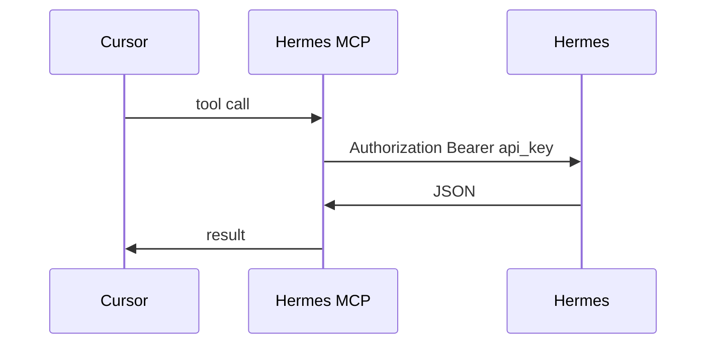

# Hermes dashboard MCP (Cursor and other LLM clients)

**Version:** 0.4 | **Date:** 2026-05-15 | **Owner:** Hermes / platform (TBD)

## Changelog

- 0.4 (2026-05-15): API keys are **owned by the creating user**; requests run as that user (audit + same lifecycle as session).
- 0.3 (2026-05-15): Simplified auth to **API keys** (dropped OAuth). Kept route catalog; trimmed scope and rollout.
- 0.2 (2026-05-15): Added §5.1 API route catalog.
- 0.1 (2026-05-15): Initial draft.

## 1. Summary and context

Operators use the Hermes dashboard to inspect agents, schedules, and runs. Cursor cannot see that state unless someone copies data by hand. This initiative adds a small **MCP server** that calls Hermes over HTTP, plus a **simple API key** on each deployment so the MCP can authenticate without browser cookies or OAuth.

**Goals**

- Answer questions and apply safe changes from the IDE via existing HTTP routes.
- Support multiple Hermes URLs (e.g. staging vs prod) via named MCP profiles (`baseUrl` + `apiKey`).
- Keep setup boring: generate a key in Hermes, paste into Cursor MCP config, done.

**Non-goals**

- OAuth, SSO, or IdP integration for MCP in v1.
- Browser automation of the dashboard UI.
- A separate duplicate API for every screen; reuse current routes where possible.

## 2. Users and stakeholders

| Persona           | Need                                                   |
| ----------------- | ------------------------------------------------------ |
| Platform engineer | Debug Hermes from Cursor with real data                |
| Customer admin    | Issue and revoke MCP keys; keys must not leak into git |
| Hermes platform   | One auth mechanism for programmatic access             |

## 3. User stories

- **[must]** As an engineer, I configure MCP with `baseUrl` and an API key, then ask Cursor about agents, schedules, and executions.
- **[must]** As an admin, I create and revoke API keys in the Hermes dashboard without redeploying.
- **[should]** As an admin, I can create a **read-only** key so the MCP cannot mutate production.
- **[could]** As someone with many environments, I use multiple MCP profiles (each with its own URL and key).

**Happy path**

1. Admin creates key in Hermes → copies once.
2. User adds Hermes MCP to Cursor with profile `baseUrl` + `apiKey`.
3. User asks a question → MCP calls Hermes with `Authorization: Bearer <apiKey>` → JSON back to the model.

## 4. Requirements

### Must-have (P0)

- **[REQ-001] API key authentication**  
  Hermes accepts `Authorization: Bearer <api_key>` on MCP-eligible routes. Keys are stored **hashed**; plaintext shown only at creation. Each key is tied to the **admin user who created it**; a valid key resolves to that user’s identity for authorization (same checks as a cookie session for that user). Invalid, revoked, or owner-inactive key → `401`.  
  **Acceptance criteria:** Integration test with valid key succeeds as the creating user; revoked key fails; deactivated owner fails; key never logged.

- **[REQ-002] Key management in dashboard**  
  Active Hermes admins can create keys for themselves (label + optional read-only). List shows id, label, **created by** (user), created, last used — never the secret. Users can revoke **their own** keys; any admin can revoke any key.  
  **Acceptance criteria:** Revoked key stops working within one request; list row includes `createdByUserId` / display name.

- **[REQ-003] MCP profiles**  
  MCP config: `name`, `baseUrl`, `apiKey` (from env or Cursor secrets — not committed). Switching profile switches host and key.  
  **Acceptance criteria:** Wrong host or key returns a clear error; no cross-profile bleed.

- **[REQ-004] API-only access**  
  MCP uses HTTP routes from §5.1; no cookie scraping.  
  **Acceptance criteria:** Documented route list matches what MCP tools call.

- **[REQ-005] Read-only keys**  
  Read-only keys get `403` on mutation routes in §5.1 (Phase B).  
  **Acceptance criteria:** Read routes work; a sample POST mutation returns `403`.

### Should-have (P1)

- **[REQ-006] Confirm destructive writes in MCP**  
  MCP tools that delete or cancel require an explicit `confirm: true` argument (second tool call), not a server dry-run protocol.  
  **Acceptance criteria:** Delete without `confirm` is rejected by the MCP tool before HTTP.

- **[REQ-007] List APIs**  
  Add `GET /api/...` list routes in §5.1.12 so “what schedules exist?” does not need new UI scraping.

### Won’t (v1)

- OAuth / OIDC for MCP.
- Headless browser control.
- Keys that outlive or exceed the creator’s role (no shared “deployment god” key without a user owner).

## 5. Functional specification

### 5.0 API key auth (Hermes)

**Header:** `Authorization: Bearer <api_key>` (same shape as other bearer usage in the repo).

**Server behavior**

1. Middleware or shared helper on MCP-eligible routes: hash incoming key, look up row, reject if missing/revoked.
2. Key record: `id`, `label`, `keyHash`, `readOnly`, `createdByUserId` (FK → `User`), `createdAt`, `revokedAt`, optional `lastUsedAt`, optional `revokedByUserId`.
3. On valid key: load **owner** `User`; reject if owner is not active `ADMIN` or `credentialVersion` mismatch (same invalidation as password reset / session).
4. Principal returned to handlers is the **owner’s** `DashboardUser` (plus `apiKeyId`, `readOnly` on the key). Read-only keys → Phase A only; full keys → Phase A + B for that user.
5. Human dashboard login (email/password cookies) stays unchanged for the UI.

**MCP package**

- Stdio/SSE MCP server; tools wrap §5.1 routes.
- `apiKey` from Cursor MCP env / config (never in repo).
- Optional: `hermes_ping` → `GET /health` or small `GET /api/mcp/whoami` returning key label, read-only flag, and owner `id` / `email` (no secret).

**Tool sketch**

- `hermes_get_*` / `hermes_list_*` — reads.
- `hermes_mutate_*` — writes; deletes/cancels require `confirm: true` in tool args (REQ-006).

### 5.1 API route catalog

Paths are relative to `{baseUrl}`. **Auth (target)** = valid API key unless noted.

| Phase | Meaning               |
| ----- | --------------------- |
| **A** | Read — ship first     |
| **B** | Write — full key only |
| **—** | Not for MCP           |

#### Existing JSON GET (`/api`)

| Phase | Method | Path                                                      | Notes                             |
| ----- | ------ | --------------------------------------------------------- | --------------------------------- |
| A     | GET    | `/api/agents/{agentId}/{agentVersion}/schemas`            | Agent schemas                     |
| A     | GET    | `/api/pipelines/{pipelineId}/schemas`                     | Pipeline step schemas             |
| A     | GET    | `/api/schedules/{scheduleId}/executions/{executionId}`    | Schedule run detail               |
| A     | GET    | `/api/http-triggers/{triggerId}/executions/{executionId}` | Trigger run detail                |
| A     | GET    | `/api/pipelines/{pipelineId}/executions/{executionId}`    | Manual pipeline run detail        |
| —     | POST   | `/api/domain-integrations/register`                       | Agent registration token, not MCP |
| —     | \*     | `/api/http-triggers/{triggerId}/invoke`                   | Trigger invoke token, not MCP     |

#### POST reads (`/dashboard/.../actions`)

| Phase | Method | Path                                   |
| ----- | ------ | -------------------------------------- |
| A     | POST   | `/dashboard/variables/actions/get`     |
| A     | POST   | `/dashboard/agent-configs/actions/get` |

#### POST mutations (`/dashboard/.../actions`) — Phase B, full key only

| Area                | Paths                                                                                                                              |
| ------------------- | ---------------------------------------------------------------------------------------------------------------------------------- |
| Agents              | `create`, `update`, `delete`                                                                                                       |
| Agent configs       | `create`, `update`, `delete`                                                                                                       |
| Variables           | `create`, `update`, `delete`                                                                                                       |
| Schedules           | `create`, `update`, `delete`, `cancel-execution`                                                                                   |
| HTTP triggers       | `create`, `update`, `delete`, `cancel-execution`                                                                                   |
| Pipelines           | `create`, `update`, `delete`, `add-step`, `remove-step`, `reorder-steps`, `update-step`, `run-pipeline`, `cancel-manual-execution` |
| Domain integrations | `delete` only                                                                                                                      |
| Admins              | `create`, `delete`, `set-active`, `reset-password`                                                                                 |

**Not HTTP today:** domain integration create (server action); dynamic `/dashboard/{integrationId}/{resource}/...` pages.

#### Excluded

| Path                                                                            | Reason                                |
| ------------------------------------------------------------------------------- | ------------------------------------- |
| `/health`                                                                       | Liveness only (optional for MCP ping) |
| `/login/*`, `/logout/*`, `/reset-password/*`, `/clear-hermes-dashboard-session` | Human session only                    |

#### Proposed list GETs (P1 — REQ-007)

`GET /api/agents`, `/api/schedules`, `/api/pipelines`, `/api/http-triggers`, `/api/variables`, `/api/agent-configs`, `/api/domain-integrations`, `/api/agents/content-generation-runs` (+ detail by id where needed).

**Implementation note:** Today these routes use dashboard **cookies**. v1 work adds API key validation alongside (or instead of) cookie auth on the same handlers.

## 6. Non-functional requirements

- Keys: hash at rest (e.g. bcrypt or SHA-256 + pepper); constant-time compare.
- MCP must not log keys; Cursor config uses secrets.
- HTTPS only in production.
- Optional rate limit per key (P1).

## 7. Dependencies and risks

| Risk                      | Mitigation                                                                                 |
| ------------------------- | ------------------------------------------------------------------------------------------ |
| Shared key = shared power | Keys tied to creating user; read-only keys; revoke in UI; audit `createdBy` / `lastUsedAt` |
| Key in git                | Docs + secret scanning; keys only in Cursor/env                                            |
| Cookie-only routes today  | Single auth helper: API key **or** session for same handlers                               |
| LLM deletes production    | MCP `confirm` gate on destructive tools (REQ-006)                                          |

## 8. Rollout

1. **v1a:** API key model + key UI + API key on Phase A read routes + MCP read tools.
2. **v1b:** Phase B mutations + read-only enforcement + MCP write tools with confirm.
3. **v1.1:** List GETs (REQ-007) if reads feel too thin.

Rollback: revoke keys; disable MCP in Cursor.

## 9. Visual

## 10. Confirmed decisions

- **Auth:** API key per deployment (not OAuth in v1); each key **belongs to the admin who created it** and acts as that user.
- **Transport:** Existing HTTP routes; add key validation to them.
- **Multi-env:** MCP profiles with `baseUrl` + `apiKey`.
- **Writes:** Allowed with full key (as the owner user); destructive MCP tools require `confirm: true` (client-side), not a server dry-run protocol.
- **Superseded:** Per-user OAuth, OAuth scopes, IdP federation — out of scope unless revisited in a later PRD.
