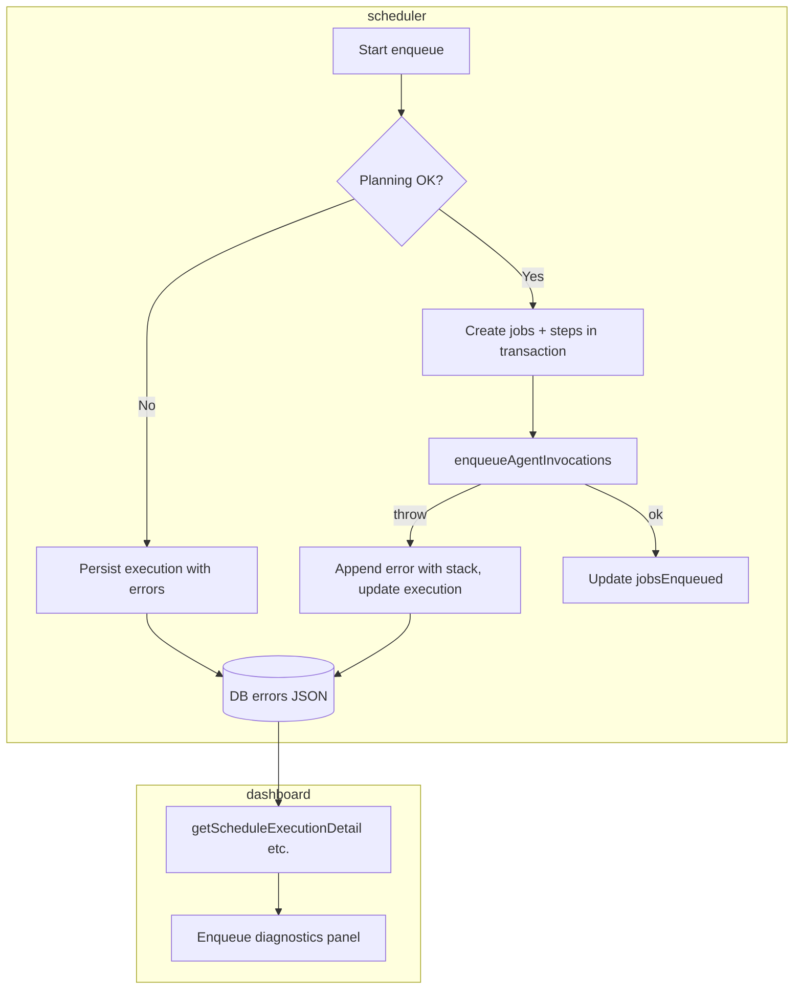

# Hermes: Enqueue failure diagnostics for dashboard admins

**Version:** 1.0 | **Date:** 2026-04-10 | **Owner:** Hermes platform (TBD named DRI)

## Changelog

- 1.0 (2026-04-10): Initial PRD — enqueue failure visibility on execution detail; operator-level detail per stakeholder choice.

## 1. Summary and context

- **Problem statement (why now):** When a pipeline execution’s **enqueue phase** fails, the Hermes dashboard execution detail page shows **Enqueue status: failed** (and empty steps / invocations) but **no actionable reason**. Operators cannot distinguish configuration mistakes, planning failures, DataQueue outages, auth issues, or code defects without digging elsewhere (logs, DB). This extends mean time to diagnose and erodes trust in the product (see execution UI: status only, no error panel).

- **Business / product goals:** Reduce time-to-resolution for failed enqueues; make the dashboard **self-sufficient for first-line triage**; align UI with data the system already captures or should capture.

- **Non-goals (this release):**
  - Surfacing enqueue errors on **list / history** tables (only execution detail in v1).
  - Automated **notifications** (email/Slack) for enqueue failures.
  - **Fixing** underlying causes of specific failures (separate tickets).
  - **Public** or tenant-facing error pages (dashboard is authenticated admin UX only).

## 2. Users and stakeholders

- **Primary personas:** Hermes **platform admins** and **on-call engineers** who debug schedules, HTTP triggers, and manual pipeline runs.

- **Stakeholders:**

  | Role                      | Interest / authority                              |
  | ------------------------- | ------------------------------------------------- |
  | Hermes engineering        | Implementation, data model, scheduler correctness |
  | SRE / on-call             | Fast diagnosis, correlation with logs             |
  | Internal pipeline authors | Understand misconfiguration vs platform fault     |

- **How input was gathered:** Product screenshot of failed enqueue with empty diagnostics; codebase review shows `ScheduleExecution.errors` (JSON) is populated in `execute-schedule` for several paths but **not shown** on `ScheduleExecutionDetailPage` (and parallel pages).

## 3. User stories and experience

### User stories (priority)

- **[must]** As a **Hermes admin**, I want to see **why enqueue failed** on the execution detail page so that I can **fix the schedule/pipeline or escalate with evidence** without guessing.

- **[must]** As an **operator**, when enqueue **partially** succeeds, I want to see **what went wrong** alongside missing or failed jobs so that I can **recover or retry knowingly**.

- **[should]** As an **operator**, I want **structured context** (e.g. step id, batch phase, exception name) when available so that I can **map failures to code paths and logs**.

- **[could]** As an **operator**, I want a **copy-to-clipboard** of the error payload for **tickets**.

### Critical user journeys

1. **Planning / validation failure (0 jobs):** Execution row exists; enqueue failed; steps table empty — user reads **errors panel** explaining e.g. missing steps, bad variable expansion, HTTPS policy, unknown agent version.

2. **DataQueue / infrastructure failure after job rows created:** Enqueue may be `failed` or `partial`; **errors** include enqueue exception message; job rows may show failed state — user ties **orchestration error** to **per-job** state.

3. **Legacy or empty `errors`:** Enqueue failed but JSON null — user sees explicit **“No detailed error was recorded”** plus guidance (check server logs, version note) per §5.

### Success metrics

| Metric                                                                    |                           Baseline |                                                   Target (post-release) |
| ------------------------------------------------------------------------- | ---------------------------------: | ----------------------------------------------------------------------: |
| Median time for admin to name **root cause category** for enqueue failure | Unknown (qual: “often &gt;15 min”) | Qual: “majority within 5 min using only dashboard + existing logs link” |
| Support / on-call threads lacking **error text**                          |                               High |                                  Meaningful reduction (track 2–4 weeks) |
| Executions with `enqueueStatus=failed` and **non-null `errors`**          |        Partial (backend dependent) |     **100%** of known failure paths persisting at least one error entry |

## 4. Requirements

### Must-have (P0)

- **[REQ-001] Execution detail — error panel**

  When `enqueueStatus` is `failed` **or** `partial`, the execution detail page must show a dedicated **“Enqueue diagnostics”** region above or directly below the status summary.

  **Acceptance criteria:**
  - Given an execution with `enqueueStatus ∈ { failed, partial }` and non-null `errors`, when the admin opens the detail page, then the UI renders all persisted error entries in **chronological order** with at least **message** and **timestamp**.
  - Given `enqueueStatus === failed` and `errors` is null or empty, the UI shows a clear empty state: **no recorded detail** and a short hint (e.g. older version, worker crash before persist — wording TBD in copy review).
  - Given `enqueueStatus === success`, the diagnostics region is **hidden** or collapsed by default (no noise).

- **[REQ-002] Parity across execution sources**

  The same diagnostics behavior applies to:
  - Schedule execution detail (`/dashboard/schedules/.../executions/...`)
  - HTTP trigger execution detail (`/dashboard/http-triggers/.../executions/...`)
  - Manual pipeline execution detail (`/dashboard/pipelines/.../executions/...`)

  **Acceptance criteria:** For each route, fixture or integration test (or documented manual QA checklist) proves a failed enqueue with JSON `errors` renders identically by component/pattern.

- **[REQ-003] Operator-grade detail (confirmed scope)**

  Persist and display **maximum safe diagnostic detail** for trusted dashboard users:
  - At minimum: `message`, ISO **timestamp**.
  - When available from caught exceptions: **exception name / type**, **stack trace** (string), optional **cause** chain.
  - When available from planning: **pipelineStepId**, **agentId@version**, **phase** (`planning` | `enqueue` | `transaction` — enum names need engineering alignment).

  **Acceptance criteria:**
  - Given a thrown `Error` during `enqueueAgentInvocations`, the stored diagnostic includes the **message** and, when `stack` is present on the error object, the **stack** in the persisted JSON (not only `err.message`).
  - Sensitive values (secrets, tokens) must remain masked per existing `maskSecretsInJson` / dashboard rules if error objects ever embed config snippets.

- **[REQ-004] API / JSON contract**

  The existing authenticated execution detail API responses must include the same `errors` payload the UI uses (already present in data layer for schedules; verify HTTP trigger + manual).

  **Acceptance criteria:** `GET` execution detail returns `execution.errors` consistent with DB; no new public unauthenticated surface.

### Should-have (P1)

- **[REQ-005] Correlation hints**

  Where execution metadata or logger context includes **scheduleExecutionId**, **request id**, or **worker tick id**, surface a copyable **correlation** field in the panel to grep centralized logs.

  **Acceptance criteria:** If `metadata` JSON on the execution row holds a correlation key agreed in §10, it appears in diagnostics.

### Could-have (P2)

- **[REQ-006] Copy raw JSON** — Button copies masked `errors` (+ optional metadata) for pasting into an issue.

### Won’t (this release)

- Cross-page **badges** on execution lists showing error snippets.
- **Email/Slack** alerts.
- **End-user** facing error messaging outside Hermes dashboard.

## 5. Functional specification

### States

| State           | UI                                      |
| --------------- | --------------------------------------- |
| Enqueue success | No diagnostics banner (default).        |
| Enqueue partial | Diagnostics **open**, severity warning. |
| Enqueue failed  | Diagnostics **open**, severity error.   |

### Data

- **Source of truth:** `errors` JSON column on `ScheduleExecution`, `HttpTriggerExecution`, and `ManualPipelineExecution` (same conceptual shape).
- **Recommended canonical shape** (array of objects; backward compatible with current `{ message, timestamp }[]`):

```json
[
  {
    "timestamp": "2026-04-10T12:34:56.789Z",
    "message": "human readable summary",
    "severity": "error",
    "phase": "enqueue",
    "code": "ENQUEUE_BATCH_FAILED",
    "pipelineStepId": "uuid optional",
    "exception": {
      "name": "Error",
      "message": "...",
      "stack": "..."
    }
  }
]
```

- **Masking:** Run error objects through the same secret-masking approach as other JSON exposed in HTML/API if payloads may contain substituted secrets.

### Flow (high level)



## 6. Non-functional requirements

- **Security / privacy:** Dashboard auth required; treat stacks and internal messages as **internal-only** (no `NEXT_PUBLIC` leakage). Mask secrets in any JSON rendered or downloadable from the UI/API.

- **Accessibility:** Diagnostics region has an accessible name (e.g. `aria-label="Enqueue diagnostics"`), readable contrast, keyboard-scrollable content for long stacks.

- **Observability:** Scheduler should continue logging failures; persisted errors are **additional** correlation, not a replacement for logs.

- **Reliability:** If JSON is malformed, UI falls back to **raw string** sub-view or “Invalid error payload” with request to file a bug (avoid blank page).

## 7. Dependencies and risks

| Item                     | Notes                                                                                                                                          |
| ------------------------ | ---------------------------------------------------------------------------------------------------------------------------------------------- |
| Scheduler / worker paths | All code paths that set `enqueueStatus=failed` must append to `errors` (audit `execute-schedule`, HTTP trigger executor, manual run executor). |
| Schema                   | Optional migration if moving from ad-hoc array to stricter validation — may stay JSON with TS types only.                                      |
| Risk: oversized stacks   | Mitigation: cap stored stack length (e.g. 32–64 KB) with truncation flag.                                                                      |
| Risk: PII in messages    | Mitigation: strip known patterns post-v1 if observed; not blocking v1 for internal admins.                                                     |

## 8. Rollout and flexibility

- **Phasing:** v1 = UI + completeness audit of persistence; feature flag **not required** unless rollout is gradual (default on for internal Hermes).

- **Backward compatibility:** Older rows with `{ message, timestamp }` only must still render.

- **Post-v1:** List/history snippets, notifications, tenant-scoped error policies.

## 9. Visuals

- **Reference:** Dashboard screenshot `image-1045ede8-ff5b-489d-b907-bbe76613e110.png` (failed enqueue, empty steps) — takeaway: **status without diagnostics is insufficient**.

- **§5 Mermaid** — takeaway: failures must be **persisted at enqueue time** and **surfaced** on detail load.

## 10. Confirmed decisions and assumptions

- **Error depth:** **Operator mode** — show full internal diagnostic detail (including stack traces when available) to authenticated Hermes dashboard admins.

- **Surface area (v1):** **Execution detail pages only** — not execution list tables or outbound notifications.

- **Assumption:** Dashboard users are **trusted internal operators**; no per-field ACL in v1.

- **Assumption:** The `errors` JSON field remains the persistence mechanism; extending entries with `exception.stack` is preferred over adding many new columns.

---

## Rubric self-assessment (draft)

| Criterion               |  Score | Notes                                      |
| ----------------------- | -----: | ------------------------------------------ |
| Clarity                 |      9 | Plain language; concrete REQ ids           |
| Comprehensiveness       |     15 | Problem, scope, data shape, risks, rollout |
| Structure               |     10 | Template followed                          |
| Prioritization          |     10 | MoSCoW-style sections                      |
| Testability             |     10 | Acceptance criteria per REQ                |
| Stakeholder involvement |      8 | Roles table; add named DRI in Owner        |
| User-centric focus      |     14 | Personas, journeys, metrics                |
| Visual aids             |      4 | Mermaid + screenshot reference             |
| Flexibility             |      5 | Post-v1 called out                         |
| Version control         |      5 | Version + changelog                        |
| **Total**               | **90** | **Excellent**                              |

**Next steps toward 90+ sustaining:** Assign named Owner/DRI; run one **engineering spike** to enumerate every `enqueueStatus=failed` branch and confirm `errors` population; replace one “wording TBD” with final UX copy after review.
