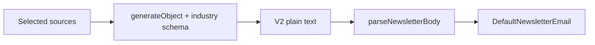

# Industry intelligence newsletter (content-generation + email)

**Version:** 1.0 | **Date:** 2026-05-16 | **Owner:** Mediapulse platform / agents

## Changelog

- 1.0 (2026-05-16): Initial PRD from approved technical plan (`industry_intelligence_newsletter_53f1877a.plan.md`). Default source article count set to **10** (configurable in Hermes).

## 1. Summary and context

Newsletters today read like a short executive summary plus a few parallel article blurbs. Operators and readers want a **sector-grounded industry briefing**: several themed sections, optional personality headings, and many **Quick Hits** with links, without turning the product into stock tips.

**Goals**

- Ship a **versioned LLM JSON contract** (“industry briefing”) with fixed sections, optional extras, and **grounded links** via `articleIndex` (1-based into numbered sources in the prompt), with URLs **injected after** the model responds (same safety model as today).
- Emit a **plain-text wire format V2** (machine marker + deterministic blocks) that `@workspace/email-templates` can parse, while **legacy bodies without the marker** keep rendering unchanged.
- Raise how many articles are passed into the prompt by default so Quick Hits and clusters are not stuck reusing three URLs.
- Update **DefaultNewsletterEmail** and **citation parsing** so V2 bodies look right in email and footnotes or citation lists stay complete.

**Non-goals (this release)**

- **Chart of the Week** or any image or hosted-chart pipeline.
- Emoji or decorative characters inside **wire control lines** the parser keys on (display copy from the model may still use emoji if prompts allow).
- Replacing or migrating historical stored JSON in bulk; legacy wire text remains valid indefinitely.

## 2. Users and stakeholders

| Who                                             | Need                                                                       |
| ----------------------------------------------- | -------------------------------------------------------------------------- |
| **Newsletter readers (business owners, execs)** | Scan a structured briefing by theme; trust that links map to real sources. |
| **Hermes operators**                            | Configure how many sources feed generation; previews stay understandable.  |
| **Engineering**                                 | Typed contracts, tests, backward-compatible parsing, clear dev-docs.       |

**Stakeholders:** Product (scope and tone), content-generation owners (agent + prompts), email-templates owners (parse/render), docs (dev-docs).

**Input:** Prior plan and repo audit of `llm-generate-newsletter`, `format-newsletter-content`, `parse-newsletter-body`, `DefaultNewsletterEmail`, `parse-newsletter-citations`.

## 3. User stories and experience

**Must**

- As a reader, I want sections such as industry pulse, competitive moves, and quick hits so I can skim by topic.
- As a reader, I want “read full article” links that match the numbered sources, not arbitrary URLs from the model.

**Should**

- As an operator, I want a higher default article count so briefings feel less repetitive.
- As an operator, I want `{{date}}` in prompts to nudge variety week to week without new placeholders.

**Could**

- Optional blocks (read/watch/listen, quote of the week) only when grounded.

**Won’t (this release)**

- Chart of the week, new asset hosting, or changing how sources are selected beyond count defaults.

**Success metrics**

- New newsletters validate against the industry schema in CI; zero regression on legacy fixture bodies.
- Spot-check: generated V2 body parses and renders in `DefaultNewsletterEmail` with citations including all grounded URLs.

## 4. Requirements

### Must-have (P0)

- **[REQ-001] Industry briefing Zod schema**  
  Versioned structured object with at least: **Industry Pulse** (prose lead); **Competitive Landscape** (2–3 bullets, optional `articleIndex` per bullet); **Deals and Movements** (1–3 bullets); **Regulatory and Policy Watch** (1–3 bullets); **Disruptors or Tech and Innovation** (single subsection, either/or in content, 1–3 bullets or short prose); **Quick Hits** (5–7 one-line items, each with `articleIndex`).  
  Optional grounded-only: **Read / Watch / Listen** (one pick + `articleIndex`); **Quote of the Week** (quote, attribution, optional `articleIndex`). Optional blocks must be omittable without validation failure.  
  **Acceptance criteria:** Co-located Vitest covers valid minimal payloads, optional blocks, and invalid `articleIndex` / shape failures; JSDoc on exported validators and helpers; kebab-case new files.

- **[REQ-002] V2 wire serializer**  
  First line marker **`MP_NEWSLETTER_V2`**; deterministic machine section boundaries separate from LLM `displayHeading` values inside blocks; legacy formatter remains available for tests or migration.  
  **Acceptance criteria:** Golden-string tests for serializer; parser contract documented in dev-docs; no marker change after merge without version bump story.

- **[REQ-003] Post-LLM URL injection**  
  After `generateObject`, map each `articleIndex` to the URL of the corresponding numbered article in the user prompt; never persist model-supplied raw URLs for grounded slots.  
  **Acceptance criteria:** Unit tests mirror today’s `topNewsWithUrls`-style behavior for index bounds and missing index handling.

- **[REQ-004] Prompts and lens**  
  Default `SYSTEM_PROMPT` and `DEFAULT_USER_PROMPT_TEMPLATE` in `llm-generate-newsletter.ts` target **industry and competitive context** for business leaders; forbid buy/sell/hold and price targets; use `{{tickerName}}` / `{{tickerSymbol}}` to set **sector lens**, not as the only subject every paragraph; include `{{date}}` for rotation hints.  
  **Acceptance criteria:** Tests updated for new prompts and schema; `run.test.ts` fixtures adjusted if output shape changes.

- **[REQ-005] Config default source count**  
  Raise default `output.topNewsCount` (or add `maxSourceArticles` if renamed for clarity) to **10**, Hermes-configurable; document in config reference.  
  **Acceptance criteria:** Schema default + tests; dev-docs config page updated.

- **[REQ-006] Email parse and render**  
  Extend `parseNewsletterBody` to return a discriminated union or widened type: legacy unchanged when V2 marker absent; V2 returns structured `industryBrief` (or equivalent) for rendering.  
  **Acceptance criteria:** Legacy fixtures unchanged; V2 fixtures pass; 100% coverage on new branches per project standards.

- **[REQ-007] DefaultNewsletterEmail V2 branch**  
  Render section headings, bullets, and Quick Hits with the same link styling as legacy top news.  
  **Acceptance criteria:** Visual structure covered by component tests or snapshot tests already used in package.

- **[REQ-008] parseNewsletterCitations for V2**  
  Build deduped citations from **all** grounded URLs in V2, not only legacy `topNewsItems`.  
  **Acceptance criteria:** Dedicated tests for multi-section URLs and deduplication.

### Should-have (P1)

- **[REQ-009] Hermes / operator copy**  
  Update any UI copy that assumes only “Top N News” if user-visible.

### Could-have (P2)

- **[REQ-010] Follow-up**  
  Split LLM into two calls if token or validation failure rate rises (tracked after launch).

### Won’t (this release)

- Chart of the week; emoji in wire control lines.

## 5. Functional specification

**Flow**

**Legacy:** Bodies without `MP_NEWSLETTER_V2` parse exactly as today (`EXECUTIVE SUMMARY`, `TOP N NEWS`, etc.).

**Grounding:** Any bullet or quick hit that should show “Read the full article: …” carries `articleIndex` ∈ [1, N] for N numbered articles in the prompt. Code strips or ignores invalid indices per explicit error-handling rules in implementation (documented in dev-docs).

**Risks:** Larger schema and more articles increase tokens and `generateObject` validation failures. Mitigations: prompt optional blocks to omit when ungrounded, keep `maxTokens` conservative, rely on existing `retryWithBackoff`.

## 6. Non-functional requirements

- **Compatibility:** Existing DB rows with legacy wire bodies render unchanged.
- **Quality:** `pnpm format:check` and scoped `pnpm code-quality` (or package filters) pass before merge; no `process.env` in new code (use `@mediapulse/env` where applicable).
- **Security:** Do not trust model-authored URLs for grounded links.

## 7. Dependencies and risks

- **Dependencies:** `@workspace/email-templates`, content-generation agent package, dev-docs MDX.
- **Risks:** LLM validation churn (mitigated above); merge order if stacked PRs — ship parser before or with generator, or ensure V2 not emitted until parser merged (see tickets).

## 8. Rollout and flexibility

- No feature flag required if V2 only appears when the agent ships the new generator; legacy parser path stays default for old bodies.
- If stacked PRs merge out of order, intermediate main must not send V2 bodies until parser PR lands (tickets call this out).

## 9. Visuals

- Section layout follows existing email typography; no new Figma in this PRD. Email package tests act as the contract for structure.

## 10. Confirmed decisions and assumptions

- **Chart of the Week** deferred until a chart or image pipeline exists.
- **Default article count** for this PRD: **10** (within the 8–12 band from the plan), still overridable in Hermes.
- **V2 marker:** `MP_NEWSLETTER_V2` as first line of body.
- **PRD source file** for tickets: `~/.cursor/plans/industry-intelligence-newsletter.prd.md` (local); GitHub `prd_url` may be `unresolved` until published to `prds` branch if the team adopts that flow.

---

## Rubric self-score (draft)

| Criterion         |  Score |
| ----------------- | -----: |
| Clarity           |      9 |
| Comprehensiveness |     14 |
| Structure         |     10 |
| Prioritization    |      9 |
| Testability       |     10 |
| Stakeholders      |      8 |
| User-centric      |     13 |
| Visuals           |      4 |
| Flexibility       |      4 |
| Version control   |      5 |
| **Total**         | **86** |

**Band:** Good. **Next steps to 90+:** After first implementation pass, add measured success metrics from production logs if available; confirm Hermes copy audit with a named owner.
