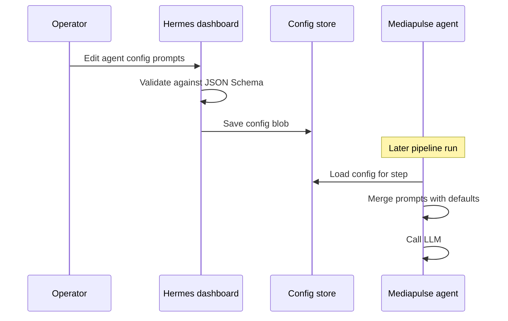

# Mediapulse agent prompts editable in Hermes

**Version:** 0.1 | **Date:** 2026-05-15 | **Owner:** Mediapulse platform (TBD name)

## Changelog

- 0.1 (2026-05-15): First draft. Stakeholder Q&A was skipped; assumptions are listed in §10 as provisional.

## 1. Summary and context

Today, Mediapulse agents that call an LLM do not all expose their system and user wording the same way. Some prompts live only in TypeScript (for example query-analysis builds `systemContent` and `userContent` from helper functions). Content-generation is further along: its Zod config already allows optional `prompts.systemPrompt` and `prompts.userPromptTemplate`, with defaults in code, and Hermes can edit agent configs through the existing JSON-schema form.

That split makes prompt experiments uneven. Operators who are used to changing keys and models in Hermes still have to open a repo and redeploy to try a different system message for parts of the stack. The goal is one clear pattern: any agent that sends fixed or templated natural-language instructions to a model should read those strings from the **Hermes agent config** (the same persisted config object pipelines already reference), with code holding **defaults** only.

**Non-goals for this initiative**

- Replacing Hermes agent config with a new microservice or a separate “prompt store.”
- Automatic prompt optimization, A/B routing, or model selection policy (unless explicitly folded in later).
- Letting end customers of Mediapulse edit prompts (tenant-facing self-service) unless product later expands scope.

## 2. Users and stakeholders

**Primary users**

- **Pipeline operators** — Adjust agent configs in Hermes when behavior needs tuning without a release train.
- **Engineers** — Keep defaults and schema in sync; review risky prompt edits.

**Stakeholders (roles)**

- **Mediapulse engineering** — Schema, runtime wiring, tests.
- **Hermes / orchestration owners** — No breaking change to agent config storage or API; confirm RBAC for config edits.
- **Content or research stakeholders** — May propose copy; acceptance is qualitative plus regression checks.

**How input was gathered**

- Code review of `content-generation` config schema and `query-analysis` / `article-analysis` run paths (internal).

## 3. User stories and experience

| Priority   | Story                                                                                                                                                      |
| ---------- | ---------------------------------------------------------------------------------------------------------------------------------------------------------- |
| Must       | As an operator, I want to set system and user prompt templates for each Mediapulse LLM agent in Hermes so that the next runs use my text without a deploy. |
| Must       | As an engineer, I want in-repo defaults to apply when Hermes leaves prompt fields empty so that new configs stay safe.                                     |
| Should     | As an operator, I want the dashboard to show which placeholders each template supports so I do not break runs with typos.                                  |
| Should     | As an engineer, I want prompt changes reflected in observability (e.g. prompt hash or length) so we can compare runs before and after an edit.             |
| Could      | As an operator, I want a read-only preview of substituted placeholders for a sample ticker so I can sanity-check long templates.                           |
| Won’t (v1) | Draft vs published versions with rollback UI (see §8).                                                                                                     |

**Critical journeys**

1. Operator opens Agent config in Hermes, selects agent version, fills `prompts` (or equivalent group), saves. Next scheduled or manual run for a pipeline step that references that config uses the new text.
2. Operator clears optional prompt fields → agent falls back to code defaults; run still succeeds.
3. Operator enters an unknown placeholder → validation fails at save or parse time with a clear error (exact behavior in requirements).

**Success metrics**

- **Coverage:** 100% of Mediapulse agents that call an LLM with a system and/or user message expose those strings (or templates) through the published config JSON schema.
- **Time to experiment:** Median time from “idea for new wording” to “first production run using it” no longer blocked on app deploy (qualitative survey or incident postmortes).
- **Stability:** No increase in run failures attributable to empty or malformed prompts after rollout (baseline week before vs after).

## 4. Requirements

### Must-have (P0)

- **[REQ-001] Single pattern**  
  For every Mediapulse agent package that invokes an LLM with `system` and/or `user` role content, the final strings sent to the model are resolved as: `configured value ?? code default`. Configured values come only from the validated Hermes agent config payload (already passed into `AgentRunContext`).

  **Acceptance criteria:** Grep of `role: "system"` / `role: "user"` in agent `run` paths shows no remaining hardcoded multi-sentence prompt bodies that cannot be overridden via config for those agents; constants may remain as **default** strings referenced by schema defaults or merge logic.

- **[REQ-002] JSON schema surface**  
  Each affected agent exports a `configSchema` (existing mechanism) that includes documented fields for system prompt and, where applicable, user prompt template. Descriptions in the schema (or nested `prompts` object) list supported placeholders per agent.

  **Acceptance criteria:** Hermes `SchemaForm` loads the schema from `/api/agents/.../schemas` and renders editable fields without manual JSON editing for the prompt sections; existing variable-expansion picker continues to work where already integrated.

- **[REQ-003] Placeholder safety**  
  For agents that use template substitution (e.g. `{{tickerId}}`), invalid or unknown placeholders in configured templates are rejected at config validation time with a message that names the bad token.

  **Acceptance criteria:** Unit tests for config parse / merge cover at least one bad placeholder; Hermes save path returns a field-level error when validation runs server-side (same as other config validation).

- **[REQ-004] Size and encoding**  
  Configurable prompts have a documented maximum length (per field) large enough for real newsletters but bounded to protect DB and model context limits; UTF-8 preserved end-to-end.

  **Acceptance criteria:** Schema `maxLength` (or equivalent Zod `.max()`) defined; exceeding length fails validation with a clear message.

- **[REQ-005] Secrets**  
  Prompt fields must not be used to store API keys; existing keys stay in dedicated config fields. Documentation states this.

  **Acceptance criteria:** Dev-docs or agent README note; no new env-based prompt bypass introduced.

### Should-have (P1)

- **[REQ-010] Parity for “dynamic” prompts**  
  Agents that today build prompts from many small config knobs (e.g. query-analysis weights baked into system text) either expose optional full `systemPrompt` / `userPromptTemplate` overrides **or** a documented mapping table in the PRD appendix so operators know which scalar fields still change wording. Prefer full-string overrides when the composed prompt is short enough to edit as one block.

  **Acceptance criteria:** For each such agent, engineering documents the chosen approach in dev-docs; operators can change the visible LLM instructions without code for the common case.

- **[REQ-011] Observability**  
  Runs log or expose existing `computePromptHash`-style fingerprint where already present; extend similarly for agents that gain configurable prompts.

  **Acceptance criteria:** Given two configs differing only in prompt text, run metadata or logs allow distinguishing hashes (or equivalent) without logging full prompt content by default.

### Could-have (P2)

- **[REQ-020] In-dashboard preview**  
  Substitute placeholders with sample data for a chosen ticker in a read-only preview action.

### Won’t (this release)

- Full version history and one-click rollback of prompt text in Hermes UI.
- Cross-tenant prompt libraries.

## 5. Functional specification

**Config shape**

- Reuse the existing **named agent config** model in Hermes (one JSON blob per config record, keyed by agent id + version and referenced by pipeline steps).
- Prefer a nested `prompts: { systemPrompt?, userPromptTemplate? }` object for consistency with content-generation; new agents follow that unless a flat shape is already shipped and migration cost is high.

**Resolution order**

1. Parse and validate full config with Zod (or equivalent) in the agent runtime boundary.
2. Merge prompt strings: explicit config wins; otherwise use exported default constants (same text as today’s in-code prompts where possible).
3. Run placeholder replacement on templates using the same rules as today for content-generation; other agents document their placeholder set.

**Errors**

- Validation errors: block save in Hermes (preferred) or fail fast at agent start with a structured error referencing `prompts.systemPrompt` / `prompts.userPromptTemplate`.
- Model errors (unrelated to syntax): unchanged behavior.

**Empty states**

- All prompt fields optional at schema level; empty means “use default.”

## 6. Non-functional requirements

- **Performance:** No extra round trip at run time; prompts are already in memory with config.
- **Security / privacy:** Do not log full prompts at info level in production; hashes or truncated previews only.
- **Accessibility:** Hermes form fields for long text use multiline inputs with labels from schema `title` / `description`.
- **Reliability:** Invalid config must not partially apply; whole config validation remains atomic.

## 7. Dependencies and risks

**Dependencies**

- Hermes dashboard agent config UI and API (existing).
- Agent registry publishing `configSchema` for each version.

**Risks and mitigations**

| Risk                                              | Mitigation                                                                                                              |
| ------------------------------------------------- | ----------------------------------------------------------------------------------------------------------------------- |
| Operators break output format expected downstream | Keep structured-output instructions in defaults; document that certain sentences are required for JSON mode; P2 preview |
| Schema drift between agents                       | Shared internal doc table of placeholder conventions                                                                    |
| Large prompts exceed model context                | `maxLength` plus optional warning in dev-docs                                                                           |

## 8. Rollout and flexibility

- **Phasing:** Ship agent-by-agent if needed: extend schema + runtime + tests per package; Hermes needs no deploy if schema is served from agent artifact.
- **Feature flag:** Not required if changes are backward compatible (optional new fields).
- **Rollback:** Revert Hermes config to previous JSON or clear prompt fields to restore defaults.
- **Post-v1:** Versioned prompt history, approval workflow, tenant overrides if product requests them.

## 9. Visuals

**Suggested flow (Mermaid)**

**Takeaway:** Prompts travel on the same path as other agent settings; no new persistence layer in v1.

## 10. Confirmed decisions and assumptions

**Provisional (user did not confirm in Q&A; validate before build lock)**

- v1 targets **all Mediapulse agents that call an LLM** with natural-language system/user messages, not only content-generation.
- **Source of truth** for editable text remains the existing Hermes agent config record (JSON), not git-only files.
- **Scope** is global per saved config (no new per-tenant prompt layer in v1).
- **Governance:** edits take effect for subsequent runs immediately after save; no draft/publish workflow in v1.

**Decided from codebase review**

- Content-generation already implements optional `prompts.systemPrompt` and `prompts.userPromptTemplate` with defaults in `generate-content.ts`; work for that package is mainly consistency, docs, and any UX/schema polish—not greenfield.

**N/A**

- No personal names for stakeholder sign-off were provided; roles in §2 are sufficient until named owners are assigned.

---

## Rubric self-check (draft)

| Criterion               | Score (max) | Notes                                                                       |
| ----------------------- | ----------- | --------------------------------------------------------------------------- |
| Clarity                 | 8/10        | Plain structure; some technical detail unavoidable                          |
| Comprehensiveness       | 12/15       | Stakeholder evidence thin; metrics partly qualitative                       |
| Structure               | 10/10       | Template followed                                                           |
| Prioritization          | 9/10        | MoSCoW via P0/P1/P2/Won’t                                                   |
| Testability             | 9/10        | REQ acceptance criteria present; REQ-010 slightly fuzzy                     |
| Stakeholder involvement | 6/10        | Roles only, no named decisions                                              |
| User-centric focus      | 12/15       | Operator stories strong; engineer split called out                          |
| Visual aids             | 4/5         | One sequence diagram                                                        |
| Flexibility             | 4/5         | Post-v1 called out                                                          |
| Version control         | 5/5         | Version, date, changelog present                                            |
| **Total**               | **79/100**  | Fair → Good once §10 items are confirmed and REQ-010 is tightened per agent |

**Next steps toward 90+**

1. Name the owner and confirm the provisional §10 bullets with product and Hermes admins.
2. Inventory every `apps/mediapulse/agents/*/src` LLM call site and list exact placeholder sets per agent in an appendix.
3. Tighten REQ-010 acceptance criteria per agent (override vs composed knobs).
4. Add baseline metric for “prompt-related run failures” if available from logs.
