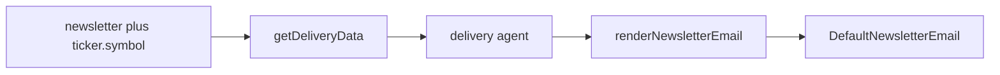

# Newsletter email: visible ticker and Mediapulse/Hyperjump branding

**Version:** 1.0 | **Date:** 2026-05-03 | **Owner:** Mediapulse product / engineering

## Changelog

- 1.0 (2026-05-03): Initial PRD from implementation plan (ticker line + footer branding + configurable URLs).

## 1. Summary and context

**Problem:** Subscribers opening the delivered newsletter often cannot tell which stock ticker the issue is for. The symbol exists in the delivery pipeline and is used only in unsubscribe copy, so the main body reads like a generic digest. There is also no clear attribution to Mediapulse or Hyperjump.

**Goals:**

- Every sent newsletter makes the **ticker symbol** obvious in the primary reading area (not only in the subject or unsubscribe link).
- The email includes **short product attribution** with **clickable links** to Mediapulse and Hyperjump marketing sites.
- Operations can **override link targets** in Hermes agent config without a code deploy.

**Non-goals:**

- Changing how `newsletter.content` is authored or stored (no duplication of the ticker inside the LLM-generated body).
- Schema or API changes to agent-data-api delivery payloads (symbol already returned with the newsletter).
- Unifying "MediaPulse" vs "Mediapulse" spelling across all legacy templates (optional follow-up).

## 2. Users and stakeholders

| Audience              | Role                                                                |
| --------------------- | ------------------------------------------------------------------- |
| Newsletter subscriber | Reads email on phone or desktop; may use HTML or plain-text client. |
| Brand / product       | Wants consistent attribution and correct outbound links.            |
| Platform ops          | Maintains Hermes delivery agent config (Resend, URLs, secrets).     |

**Stakeholders:** Engineering implements template + config + tests; ops owns canonical marketing URLs in Hermes.

Input for this spec: internal plan, current codebase behavior (`DefaultNewsletterEmail`, delivery agent), and explicit choice to use **links** for Mediapulse and Hyperjump.

## 3. User stories and experience

| Priority   | Story                                                                                                           |
| ---------- | --------------------------------------------------------------------------------------------------------------- |
| **Must**   | As a subscriber, I see which ticker this digest covers without relying on the subject line alone.               |
| **Must**   | As a subscriber, I see who produced the email (Mediapulse) and its relation to Hyperjump, with links I can tap. |
| **Should** | As an operator, I can point those links to staging or production marketing URLs via Hermes config.              |
| **Could**  | Later: align naming ("Mediapulse") across registration and newsletter templates.                                |

**Journeys:**

- **Happy path:** Delivery loads newsletter + `symbol`, renders email with ticker line and branding, sends HTML + text; client shows new blocks in both parts.
- **Edge:** `tickerSymbol` absent in rare/manual tests: template should not show a broken ticker line (hide or safe fallback).
- **Edge:** Existing Hermes configs without a `branding` block: Zod defaults apply; sends keep working.

**Success signals:**

- Qualitative: stakeholders confirm correct URLs in production.
- QA: automated tests assert ticker substring and link `href`s in rendered HTML; plain-text output includes equivalent readable lines where the renderer supports it.

## 4. Requirements

### Must-have (P0)

- **[REQ-001] Ticker visibility**
  - **Acceptance criteria:** When `tickerSymbol` is provided to the default newsletter template, the email body shows a clear line **under the main title** (before the first horizontal rule) stating which symbol the digest covers. Copy is concise (exact wording is an implementation detail; e.g. "This digest covers SYMBOL.").
  - **Verify:** Render output contains the symbol in that region; unit tests cover structured and unstructured body paths.

- **[REQ-002] Mediapulse and Hyperjump attribution with links**
  - **Acceptance criteria:** A footer **branding** section appears **above** the generic "you are receiving this because…" note (and above one-click unsubscribe when present). It includes a short explanatory sentence and two links: **Mediapulse** and **Hyperjump**, each with an HTTPS `href`.
  - **Verify:** HTML contains both anchors with configured URLs; plain-text part includes readable link URLs or link text per React Email plain-text behavior.

- **[REQ-003] Configurable branding URLs**
  - **Acceptance criteria:** Delivery agent config (Zod schema) supports optional `branding.mediapulseSiteUrl` and `branding.hyperjumpSiteUrl` as valid URLs. Omitted keys resolve to **documented defaults** so existing deployments do not break.
  - **Verify:** Schema tests or agent config parsing tests; docs list defaults and override mechanism.

- **[REQ-004] Single source of truth for ticker in layout**
  - **Acceptance criteria:** `formatNewsletterContent` (content-generation) is **not** extended to embed the ticker in stored body text; ticker remains driven from `newsletter.ticker.symbol` at render/send time.
  - **Verify:** No change to that formatter in scope, or explicit revert if attempted.

### Should-have (P1)

- **[REQ-005] Documentation**
  - **Acceptance criteria:** Dev docs for the delivery agent describe optional `config.branding` and default URLs.
  - **Verify:** `delivery.mdx` updated.

### Could-have (P2)

- **[REQ-006] Cross-template spelling alignment**
  - **Acceptance criteria:** Registration confirmation and newsletter use the same product name casing where user-visible.
  - **Verify:** N/A for this release unless pulled into scope.

### Won't (this release)

- Custom per-tenant branding beyond the two URLs.
- Localized copy for non-English locales.

## 5. Functional specification

**Rendering**

- Component: `DefaultNewsletterEmail` in `@workspace/email-templates`.
- New props: at minimum pass-through for `mediapulseSiteUrl` and `hyperjumpSiteUrl` (optional on the type for previews; delivery supplies values after config merge).
- `renderNewsletterEmail` forwards props to the default variant.

**Delivery agent**

- `DeliveryConfigSchema` adds nested `branding` with URL validation and defaults.
- `deliverNewsletterToSubscribers` reads merged config and passes URLs into `renderNewsletterEmail` together with existing `tickerSymbol`.

**Data flow (unchanged sources)**

## 6. Non-functional requirements

- **Security:** URLs come from operator config with validation (HTTPS URL strings). No raw HTML from subscribers injected into branding.
- **Reliability:** Defaults prevent misconfiguration from blocking sends when `branding` is omitted.
- **Accessibility:** Link text must be meaningful ("Mediapulse", "Hyperjump"), not generic "click here."
- **Testing:** Extend `render-newsletter-email.test.tsx` and delivery tests; run `pnpm format:check` from repo root after edits.

## 7. Dependencies and risks

| Dependency             | Notes                                                                                    |
| ---------------------- | ---------------------------------------------------------------------------------------- |
| Hermes delivery config | Ops must set production marketing URLs when defaults are placeholders.                   |
| React Email            | Plain-text generation must include new nodes; manual spot-check if a client strips HTML. |

| Risk                          | Mitigation                                                                  |
| ----------------------------- | --------------------------------------------------------------------------- |
| Wrong default URLs shipped    | Document defaults; confirm in staging before prod.                          |
| Plain-text clients omit links | Acceptable; URLs should still appear in text part when renderer emits them. |

## 8. Rollout and flexibility

- No feature flag required: template-only + config defaults.
- Ops can update Hermes `config.branding` without redeploying the agent after release.
- Post-v1: spelling alignment across templates (REQ-006).

## 9. Visuals

- **Data flow diagram:** See section 5 (mermaid). Takeaway: ticker and branding are applied at render time; stored newsletter text stays unchanged.
- **Layout:** No separate wireframe; placement is fixed: ticker line directly under title; branding block in footer stack above subscription disclaimer.

## 10. Confirmed decisions and assumptions

- Attribution includes **clickable HTTPS links** to Mediapulse and Hyperjump (not text-only).
- Branding URL defaults live in the delivery config schema; **Hermes may override** canonical marketing URLs.
- Ticker is **not** duplicated inside LLM-generated `newsletter.content`.
- Optional follow-up: align "MediaPulse" vs "Mediapulse" in other emails is **out of scope** for v1 unless explicitly scheduled.

---

## Rubric self-check (draft)

| Criterion          | Score (max) | Notes                                       |
| ------------------ | ----------- | ------------------------------------------- |
| Clarity            | 9/10        | Plain language; REQ IDs for traceability.   |
| Comprehensiveness  | 14/15       | Problem, scope, AC, rollout, risks covered. |
| Structure          | 10/10       | Template sections filled.                   |
| Prioritization     | 10/10       | MoSCoW via P0/P1/P2/Won't.                  |
| Testability        | 10/10       | AC per REQ.                                 |
| Stakeholders       | 8/10        | Roles named; owner generic.                 |
| User-centric focus | 14/15       | Subscriber-focused stories.                 |
| Visual aids        | 5/5         | One flow diagram.                           |
| Flexibility        | 5/5         | Post-v1 called out.                         |
| Version control    | 5/5         | Version, date, changelog.                   |

**Estimated total: 90/100 (Excellent)**

**To reach 91+:** Replace generic owner with a named team or person when known; add one quantitative success metric if product defines open/click baselines later.
