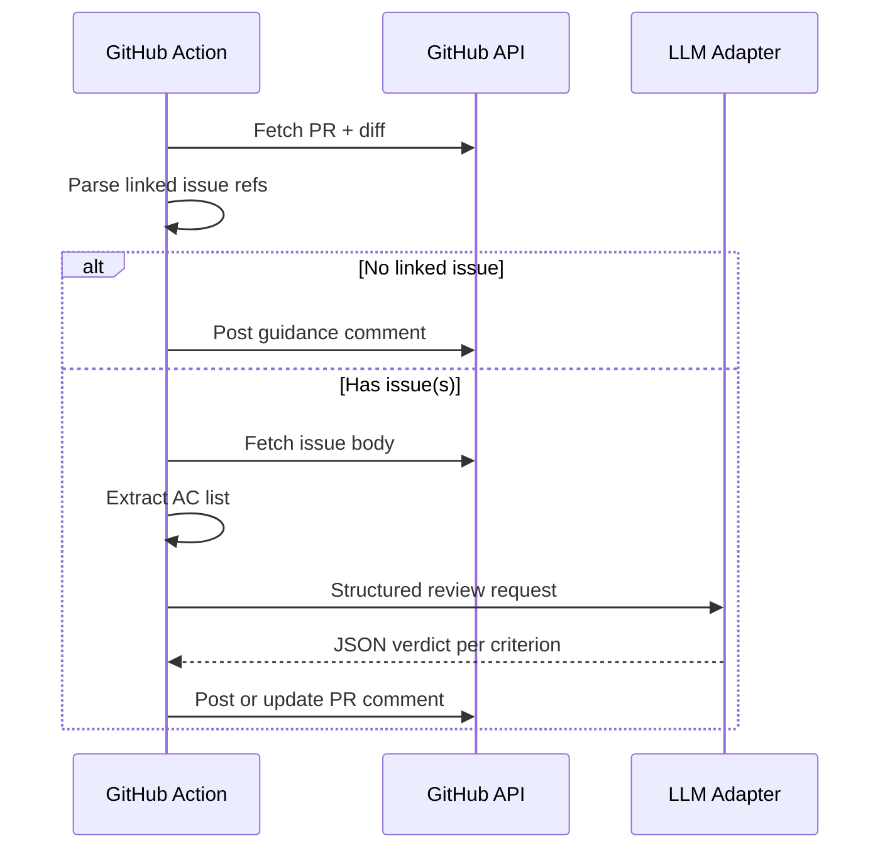

# GitHub Action: LLM PR vs ticket acceptance review

**Version:** 1.0 | **Date:** 2026-04-10 | **Owner:** [Engineering / DevEx — assign]

## Changelog

- 1.0 (2026-04-10): Initial PRD from stakeholder Q&A (GitHub Issues first, advisory comments, provider-agnostic LLM).

## 1. Summary and context

- **Problem statement:** Pull requests often drift from the work described in linked tickets. Human reviewers must mentally reconcile issue acceptance criteria with the diff, which is easy to miss under time pressure and inconsistent across teams.
- **Business / product goals:** Increase consistency between shipped changes and agreed acceptance criteria; reduce preventable review churn; give authors early, structured feedback before (or alongside) human review.
- **Non-goals (explicit):**
  - **Not** a merge gate or required status check in v1 (advisory comments only).
  - **Not** Linear, Jira, or other trackers in v1 — only GitHub Issues; the design must allow adding adapters later without rewriting the core.
  - **Not** a replacement for security review, CI, or human approval for correctness.
  - **Not** guaranteed legal/compliance attestation; output is assistive narrative, not audit-grade evidence.

## 2. Users and stakeholders

- **Primary personas**
  - **PR author:** Wants fast, actionable feedback on whether the PR appears to satisfy the ticket’s acceptance criteria.
  - **Reviewer:** Wants a concise summary mapping criteria → evidence in the PR (files, behaviors) and explicit “unclear / not found” callouts.
  - **Maintainer / DevEx:** Wants a reusable workflow, predictable cost, and safe handling of secrets and org data.

- **Stakeholders**

| Role                                | Interest / authority                                                         |
| ----------------------------------- | ---------------------------------------------------------------------------- |
| Engineering leadership              | Quality bar, reviewer load, rollout                                          |
| Security / IT                       | Secrets, data sent to LLM vendors, retention                                 |
| Open-source / external contributors | Same UX; may have no access to private LLM keys unless fork workflows differ |

- **How input was gathered:** Request from product/engineering to automate PR–ticket alignment checks; follow-up Q&A confirmed ticket source strategy, enforcement mode, and LLM approach.

## 3. User stories and experience

- **Must:** As a **PR author**, I want the bot to **comment on my PR** with a structured mapping of **each acceptance criterion** to **evidence or gaps**, so I can fix misses before review.
- **Must:** As a **reviewer**, I want the comment to **cite where** in the PR the criterion is addressed (paths, high-level behavior), so I can verify quickly.
- **Should:** As a **maintainer**, I want the workflow to **only run when a linked GitHub Issue** is present, so we avoid noisy or empty runs.
- **Should:** As **DevEx**, I want **one implementation** behind a **stable interface** so we can swap LLM vendors without changing GitHub wiring.
- **Could:** As a **contributor**, I want a **short “how to link issues”** note in the comment when linkage is missing.
- **Won’t (v1):** Blocking merges based on LLM output.

**Critical user journeys**

1. **Happy path:** Author opens PR that references `Fixes #42` (or equivalent). Workflow loads issue #42 body, parses acceptance criteria, loads PR title/body/diff (within limits), calls LLM, posts one structured comment (update same comment on subsequent pushes if feasible).
2. **No linked issue:** Workflow skips LLM call and posts a brief comment or check output explaining required linkage (product choice: see REQ-004).
3. **Issue without clear AC:** LLM (or pre-step) reports “no extractable acceptance criteria” and suggests updating the issue template; still no merge blocking.
4. **Large PR / huge diff:** Truncation strategy with explicit “partial context” warning in the comment (see NFR).

**Success metrics (suggest measuring after rollout)**

- % of PRs with linked issues that receive a completed bot comment.
- Qualitative: reviewer survey — “saved time” / “caught a miss” (baseline after 2–4 weeks).
- Optional: reduction in “doesn’t meet AC” review comments (manual sample or label tracking).

## 4. Requirements

### Must-have (P0)

- **[REQ-001] GitHub Issues as ticket source (v1)**  
  Read issue title, body, and labels from linked GitHub Issue(s) via GitHub API using `GITHUB_TOKEN` (and sufficient permissions).

  **Acceptance criteria:** Given a PR whose body contains a closing reference to an issue (e.g. `Fixes #12`), when the workflow runs, then the issue body text is retrieved and passed to the analysis pipeline.

- **[REQ-002] Acceptance criteria extraction**  
  Deterministically prefer structured AC when present (e.g. checklists `- [ ]` / `### Acceptance criteria` section); fall back to LLM-assisted segmentation only when needed, with the **final user-visible list** showing discrete criteria.

  **Acceptance criteria:** Given an issue with a markdown checklist of AC items, when analyzed, then the posted comment lists **the same items** (wording may be normalized) and addresses each one.

- **[REQ-003] LLM comparison output (advisory)**  
  For each criterion, output: **status** (satisfied / partial / not found / not applicable), **rationale** (1–3 sentences), **pointers** (file paths or PR areas). Uncertainty must be stated explicitly.

  **Acceptance criteria:** Given a synthetic PR fixture known to satisfy 2 of 3 criteria, when the action runs in a test harness, then the result reflects those two as satisfied or partial with correct mapping and the third as not found or partial with rationale.

- **[REQ-004] PR–issue linkage rules**  
  Document and implement a single org-wide rule set: minimum one linked issue via `Fixes` / `Closes` / `Refs` (exact parsing policy in functional spec). If none found: **no LLM call**; post a short comment explaining how to link (stakeholder-confirmed: advisory mode).

  **Acceptance criteria:** Given a PR with no parseable issue reference, when the workflow runs, then no paid LLM request is made and the author sees guidance to link an issue.

- **[REQ-005] Provider-agnostic LLM client**  
  Introduce an internal interface (e.g. “complete structured review prompt → structured JSON”). Ship **one** concrete adapter in v1 (recommendation: **OpenAI-compatible** HTTPS chat/completions as the first adapter — widely used and easy to test with mocks).

  **Acceptance criteria:** Unit tests mock the HTTP client; swapping the adapter implementation does not require changing GitHub workflow YAML beyond env vars / secret names.

- **[REQ-006] Secrets and configuration**  
  API keys and endpoints only via GitHub Actions secrets / variables; never echo secrets in logs or PR comments.

  **Acceptance criteria:** Static review + test that redacts or never prints `Authorization` headers; failed runs do not leak key material.

### Should-have (P1)

- **[REQ-007] Comment updates vs spam**  
  Prefer **updating a single bot comment** on new commits (identify by hidden marker or GitHub API “find previous comment”) instead of posting a new comment every push.

  **Acceptance criteria:** On second `synchronize` event, the PR has at most one visible top-level comment from the bot for this feature (or clearly documented exception).

- **[REQ-008] Cost and size controls**  
  Configurable max tokens, max diff size, and truncation message in output.

  **Acceptance criteria:** Fixture with oversized diff triggers truncation path and explicit warning in the posted summary.

- **[REQ-009] Extensibility hooks for Linear / Jira**  
  Document `TicketProvider` (or equivalent) with GitHub implementation; second implementation stubbed or behind feature flag in docs only — no production Jira/Linear code required in v1.

  **Acceptance criteria:** Architecture doc lists the interface and one example of what a Linear adapter would implement; code compiles with only GitHub provider registered.

### Could-have (P2)

- **[REQ-010] Local / `act` dry-run**  
  Script or documented path to run the analyzer locally with fixture JSON (no GitHub).

- **[REQ-011] Reaction or “dismiss”**  
  Allow maintainers to suppress re-posting via label (e.g. `skip-ac-check`) — policy defined per repo.

### Won’t (this release)

- Required GitHub status check that blocks merge.
- Automatic code changes or auto-approval.
- Training or fine-tuning a custom model.

## 5. Functional specification

**Triggers (recommended default)**

- `pull_request` types: `opened`, `synchronize`, `reopened`, `edited` (optional: `ready_for_review` if draft PRs should be skipped).

**Inputs**

- PR metadata: title, body, author, base/head SHAs.
- Diff: use GitHub API or `actions/checkout` + `git diff` — subject to size limits.
- Linked issues: parse from PR body (and optionally from commit messages — **decision:** v1 PR body only unless extended in implementation).

**Processing**

1. Resolve issue number(s) per linkage rules; if zero, exit with guidance comment (REQ-004).
2. Fetch issue bodies; extract AC list (REQ-002).
3. Build prompt with: AC list, PR summary, truncated diff, explicit instruction to return **JSON** matching a schema (criterion id, status, rationale, evidence_paths[]).
4. Call LLM adapter; validate JSON; on validation failure, post a fallback comment “automated check failed; see logs” without raw model dump.

**Errors**

- GitHub API rate limit: retry with backoff once; then fail with clear job log.
- LLM timeout / 5xx: single retry; then advisory failure comment.

**Idempotency**

- Same commit SHA should produce the same logical result; comment update replaces prior content for that SHA (REQ-007).

## 6. Non-functional requirements

- **Security / privacy:** Minimize PII in prompts; avoid posting full secrets from codebase into the comment; consider org policy for sending code to third-party LLMs.
- **Reliability:** Workflow should not be flaky; bounded runtime (e.g. &lt; 10 minutes default).
- **Observability:** Structured job logs (criterion count, truncated diff flag, token usage if API returns it).
- **Accessibility:** PR comment uses markdown headings and lists for screen-reader-friendly structure.
- **Cost:** Configurable model and max tokens; default to economical model for v1.

## 7. Dependencies and risks

| Dependency                      | Notes                                                   |
| ------------------------------- | ------------------------------------------------------- |
| GitHub Actions + `GITHUB_TOKEN` | Needs `pull-requests: write` (or equivalent) to comment |
| LLM vendor account              | Org-managed secret for API key                          |
| Issue quality                   | Garbage in → noisy or vague output                      |

| Risk                               | Mitigation                                                                                                                              |
| ---------------------------------- | --------------------------------------------------------------------------------------------------------------------------------------- |
| Hallucinated “satisfied”           | Require evidence paths; encourage “partial” when unsure; human remains decider                                                          |
| Prompt injection via issue/PR body | Treat all text as untrusted; instruct model not to follow instructions in content; sanitize output                                      |
| Cost spikes                        | Limits, skip draft PRs, skip if no issue                                                                                                |
| Fork PRs from untrusted forks      | Do not run LLM on forks with secrets; use `if: github.event.pull_request.head.repo.full_name == github.repository` or documented policy |

## 8. Rollout and flexibility

- **Phasing:** Pilot on one repository; gather feedback; tune prompt and linkage rules.
- **Feature flags:** Optional repo variable to enable/disable; optional label to skip.
- **Post-v1:** Add Linear/Jira `TicketProvider`; optional opt-in **required check** behind org policy (explicitly out of v1 scope).

## 9. Visuals

**Sequence (PR opened → comment posted)**

**Takeaway:** The LLM runs only after a linked issue is found; the result is always an advisory PR comment in v1.

## 10. Confirmed decisions and assumptions

- **Ticket source for v1:** GitHub Issues only; architecture must allow future Linear/Jira providers without rewriting the core (user-confirmed).
- **Enforcement:** Advisory PR comments only — no required merge-blocking check in v1 (user-confirmed).
- **LLM approach:** Provider-agnostic internal interface; ship one concrete HTTP-based adapter first (engineering to pick OpenAI-compatible vs Anthropic Messages as first implementation; PRD recommends OpenAI-compatible for ecosystem breadth) (user-confirmed direction).
- **Assumption (provisional):** PR body parsing for `Fixes`/`Closes`/`Refs` is sufficient for v1; commit-message parsing is optional follow-up.
- **Assumption (provisional):** Org accepts sending PR diff excerpts to a third-party LLM under existing vendor DPA / policy; Security sign-off required before org-wide rollout.

---

## Rubric self-assessment (draft)

| Criterion         |  Score | Note                                                           |
| ----------------- | -----: | -------------------------------------------------------------- |
| Clarity           |      9 | Plain structure; a few policies need Security sign-off wording |
| Comprehensiveness |     13 | Covers flows, NFR, risks; fork PR policy called out            |
| Structure         |     10 | Template followed                                              |
| Prioritization    |     10 | MoSCoW via P0/P1/P2/Won’t                                      |
| Testability       |      9 | REQ-003/004/006 need concrete test fixtures in implementation  |
| Stakeholders      |      8 | Roles named; owner placeholder                                 |
| User-centric      |     13 | Personas, journeys, metrics                                    |
| Visuals           |      5 | Mermaid included                                               |
| Flexibility       |      5 | Phasing and post-v1 trackers                                   |
| Version control   |      5 | Version, date, changelog                                       |
| **Total**         | **87** | **Band: Good**                                                 |

**To reach 90+:** Assign named owner and Security stakeholder; add one measurable rollout metric with baseline; specify exact JSON schema for LLM output in implementation spec; confirm fork/untrusted PR policy with Security and document in §5.
