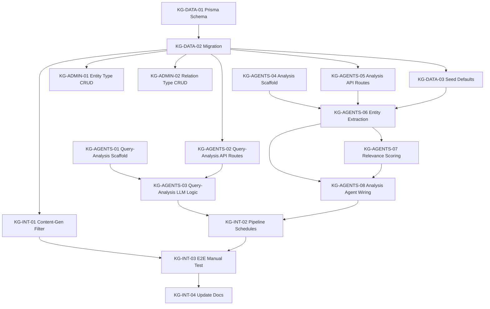

# Project Management — Per-Ticker Knowledge Graph

## Epics

| Code           | Name                                   | Tickets | Description                                                           |
| -------------- | -------------------------------------- | ------- | --------------------------------------------------------------------- |
| KG-DATA        | Knowledge Graph Data Model             | 3       | Prisma schema, migration, seed data                                   |
| KG-ADMIN       | Hermes Dashboard Admin Pages           | 2       | CRUD for entity types and relation types                              |
| KG-AGENTS      | Query-Analysis and Analysis Agents     | 8       | Two new agents + API routes in agent-data-api                         |
| KG-INTEGRATION | Pipeline Wiring and Content-Gen Filter | 4       | Wire agents into pipelines, filter content-generation, E2E test, docs |

## Dependency graph

## Suggested execution order

Work proceeds in 4 phases. Phases 2a and 2b can be done in parallel by different people.

### Phase 1 — Foundation (blocks everything)

| Order | Ticket                   | Assignable to |
| ----- | ------------------------ | ------------- |
| 1     | KG-DATA-01 Prisma Schema | Backend       |
| 2     | KG-DATA-02 Migration     | Backend       |
| 3     | KG-DATA-03 Seed Defaults | Backend       |

### Phase 2a — Admin UI (parallel track)

| Order | Ticket                         | Assignable to |
| ----- | ------------------------------ | ------------- |
| 4a    | KG-ADMIN-01 Entity Type CRUD   | Frontend      |
| 5a    | KG-ADMIN-02 Relation Type CRUD | Frontend      |

### Phase 2b — Agents (parallel track)

Scaffolding tickets (01, 04) have no dependencies and can start alongside Phase 1.

| Order | Ticket                                  | Assignable to |
| ----- | --------------------------------------- | ------------- |
| 4b    | KG-AGENTS-01 Query-Analysis Scaffold    | Backend       |
| 5b    | KG-AGENTS-04 Analysis Scaffold          | Backend       |
| 6b    | KG-AGENTS-02 Query-Analysis API Routes  | Backend       |
| 7b    | KG-AGENTS-05 Analysis API Routes        | Backend       |
| 8b    | KG-AGENTS-03 Query-Analysis LLM Logic   | Backend       |
| 9b    | KG-AGENTS-06 Analysis Entity Extraction | Backend       |
| 10b   | KG-AGENTS-07 Analysis Relevance Scoring | Backend       |
| 11b   | KG-AGENTS-08 Analysis Agent Wiring      | Backend       |

### Phase 3 — Integration (after Phase 2a + 2b)

| Order | Ticket                       | Assignable to |
| ----- | ---------------------------- | ------------- |
| 12    | KG-INT-01 Content-Gen Filter | Backend       |
| 13    | KG-INT-02 Pipeline Schedules | Backend       |
| 14    | KG-INT-03 E2E Manual Test    | QA / Backend  |
| 15    | KG-INT-04 Update Docs        | Any           |

## Parallelism summary

With 2 people, the optimal split is:

- **Person A (backend/agents):** Phase 1 -> Phase 2b -> Phase 3
- **Person B (frontend/admin):** Phase 2a (starts after Phase 1 is done)

With 3 people:

- **Person A:** Phase 1 (KG-DATA-01 through 03)
- **Person B:** KG-AGENTS-01 + 04 scaffolds (no dependency), then Phase 2b API routes + LLM logic
- **Person C:** Phase 2a (admin CRUD), then Phase 3 integration + docs
