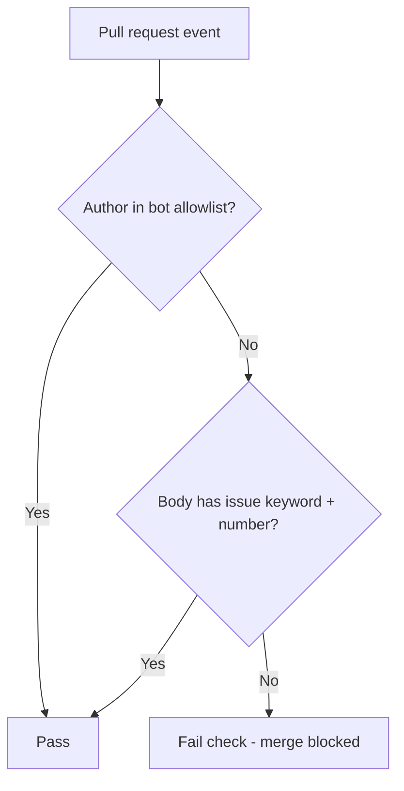

# Required GitHub issue linkage for pull requests

**Version:** 1.0 | **Date:** 2026-04-09 | **Owner:** Platform / Engineering (name TBD)

## Changelog

- 1.0 (2026-04-09): Initial PRD. Confirmed GitHub Issues + PR-body keywords + required GHA check; exceptions for dependency automation and release/chore automation.

## 1. Summary and context

- **Problem statement:** Pull requests sometimes merge without a traceable link to planned work. That weakens auditability, makes release notes and incident follow-up harder, and lets scope slip without a ticket to prioritize or accept.
- **Business / product goals:** Every merged change defaults to being attributable to tracked work (an issue). Reduce “drive-by” merges while keeping automation (dependencies, releases) frictionless.
- **Non-goals:**
  - Replacing GitHub Issues with another tracker in this phase.
  - Enforcing branch naming conventions as the primary proof of a ticket (may be added later).
  - Defining org-wide Jira/Linear integration (N/A).

## 2. Users and stakeholders

- **Primary personas**
  - **Contributor:** Opens PRs and needs a fast, unambiguous rule for what to put in the PR description.
  - **Reviewer / maintainer:** Relies on checks so policy is consistent and not debated per PR.
  - **Release / platform:** Owns branch protection and workflow maintenance.
- **Stakeholders**
  - **Engineering leadership** — policy approval, exception process.
  - **Security / compliance (if applicable)** — may care about change traceability; confirm in one governance sync.
  - **Open-source contributors (if any)** — need the rule documented in `CONTRIBUTING` or PR template.
- **How input was gathered:** Product owner request (this initiative); clarifications captured in §10.

## 3. User stories and experience

- **[must]** As a **maintainer**, I want **merges blocked when no issue is referenced**, so that **every change has a work item for context and prioritization**.
- **[must]** As a **contributor**, I want **the check to fail with a clear message and example**, so that **I can fix the PR description without guessing**.
- **[should]** As a **dependency bot user**, I want **Dependabot/Renovate PRs to pass automatically**, so that **security patches are not delayed by policy**.
- **[should]** As a **release owner**, I want **automated release/chore PRs to bypass the check**, so that **shipping pipelines stay green**.
- **Critical user journeys**
  - **Happy path:** Contributor opens PR → adds `Fixes #123` (or `Closes` / `Resolves` / `Refs`) in body → required check passes → merge allowed.
  - **Fix path:** Check fails → contributor edits description → check re-runs → passes.
  - **Bot path:** Dependabot opens PR → check skips or auto-passes per allowlist → merge proceeds per existing review rules.
- **Success metrics**
  - **Process:** 100% of merged PRs to protected branches either (a) reference ≥1 GitHub issue via accepted keywords or (b) match documented automation exceptions in audit logs.
  - **Friction:** Median time from “check failed” to “check passed” is under 5 minutes for human PRs (measure via check run timing; baseline after 2 weeks).
  - **Qualitative:** Zero recurring asks in chat of the form “why did this merge without a ticket?” for protected branches.

## 4. Requirements

### Must-have (P0)

- **[REQ-001] Issue reference in PR body**
  - **Behavior:** For every pull request targeting a **protected branch** (per rollout), the PR **body** MUST contain at least one reference that GitHub recognizes as linking to an issue in the **same repository**, using one of: `close`/`closes`/`closed`, `fix`/`fixes`/`fixed`, `resolve`/`resolves`/`resolved`, `ref`/`refs` (case-insensitive), followed by an issue number (e.g. `Fixes #123`).
  - **Acceptance criteria:**
    - Given a PR whose body is empty or has no matching keyword + `#`issue pattern, when the check runs, then it **fails** with a non-zero exit and a message that includes an example line to paste.
    - Given a PR whose body contains `Fixes #42`, when the check runs, then it **passes**.

- **[REQ-002] Required status check blocks merge**
  - **Behavior:** The verification runs on `pull_request` (types: `opened`, `synchronize`, `reopened`, `edited`) and/or equivalent events so that **editing the description** re-validates.
  - **Acceptance criteria:**
    - Given branch protection requires this check, when the check fails, then GitHub **does not allow merge** until it passes (for merge methods the org uses).
    - Given the check passes, merge eligibility follows existing review rules (this PRD does not remove required reviews).

- **[REQ-003] Auditability**
  - **Behavior:** When the check fails, the log names the PR number and states that no issue reference was found (no secrets in logs).
  - **Acceptance criteria:** A maintainer can open the failed workflow run and see why it failed without reading workflow YAML.

### Should-have (P1)

- **[REQ-004] Contributor documentation**
  - **Behavior:** Repository **pull request template** includes a short reminder and example line for linking issues; `CONTRIBUTING.md` (or equivalent) links to the rule if the file exists.
  - **Acceptance criteria:** New contributors report zero confusion in a sample review of first-time PRs (qualitative); template is present in default branch.

- **[REQ-005] Multi-issue references**
  - **Behavior:** Multiple references (e.g. `Fixes #1, #2` or several lines) are supported if GitHub’s linking semantics support them; the check passes if **at least one** valid linked issue exists per regex agreed in implementation.

### Could-have (P2)

- **[REQ-006] Cross-repo issues**
  - **Behavior:** Optionally support `owner/repo#NNN` if the org routinely tracks work in another repo’s issues.
  - **Acceptance criteria:** Documented and covered by workflow tests; disabled by default until needed.

### Won’t (this release)

- Blocking based solely on **linked issues UI** without body keywords (out of scope for v1).
- Automatic creation of issues for missing links (out of scope).

## 5. Functional specification

- **Inputs:** PR number, PR body text (from GitHub API or event payload), PR author, optional labels (for exceptions).
- **Pass logic (human PRs):** Body matches a vetted pattern equivalent to GitHub’s documented linking keywords + issue reference.
- **Bypass logic (automation):** PR is exempt if **any** of:
  - Author is **Dependabot** or **Renovate** (e.g. `dependabot[bot]`, `renovate[bot]` — exact list in implementation must follow GitHub’s current bot usernames/apps).
  - PR matches **release/chore automation** criteria defined in repo config (recommended: label allowlist such as `release`, `chore-no-ticket`, and/or author allowlist such as `github-actions[bot]` for known workflows). **Initial allowlist is maintained in one YAML file** next to the workflow to avoid drift.
- **Failure UX:** Annotate the PR with a **check run** named predictably (e.g. `pr-issue-link`); summary text includes: “Add a line such as `Fixes #<issue>` to the PR description.”
- **Empty body:** Fail (same as missing reference).

### Proposed automation flow

## 6. Non-functional requirements

- **Reliability:** Check completes in under 30 seconds in typical cases; no dependency on flaky third-party APIs beyond GitHub.
- **Security:** Token used has least privilege (`pull-requests: read` or narrower if feasible); no posting secrets to logs.
- **Privacy:** Do not dump full PR bodies into external systems.
- **Maintainability:** Workflow and allowlist file colocated; changes require PR review like other CI.
- **Accessibility / UX:** Failure message readable in GitHub UI and in email notifications (plain text clarity).

## 7. Dependencies and risks

- **Dependencies:** GitHub Actions enabled; permission to update **branch protection** on target branches; org may require GitHub Teams for enforced rulesets.
- **Risks**
  - **False negatives:** Unusual but valid phrasing not detected → mitigate with documented examples and P2 cross-repo option.
  - **False positives for bots:** New bot username not allowlisted → mitigate by documenting how to extend YAML allowlist.
  - **Forks / external contributors:** Missing issue permissions → mitigated because issue refs are in text; no special perms required to **cite** `#123` if issues are visible.
- **Rollout dependency:** Branch protection must reference the new check name exactly.

## 8. Rollout and flexibility

- **Phase 1 (soft):** Run workflow as **non-required** for 1–2 weeks; monitor failure rates and message clarity.
- **Phase 2 (hard):** Add as **required** status check on default branch and other protected release branches; announce in team channel.
- **Feature flags:** Not applicable; use branch protection timing as the gate.
- **Rollback:** Remove required check from protection; workflow can remain optional.
- **Post-v1:** Optional branch-name enforcement, optional Linear/Jira deep links, optional “linked issues” panel validation as secondary signal.

## 9. Visuals

- See **§5** Mermaid flowchart — takeaway: bots bypass; humans must cite an issue in the PR body or the check fails.

## 10. Confirmed decisions and assumptions

- **Ticket system:** GitHub Issues in the repository where the PR lives (v1).
- **Link mechanism:** PR description must include GitHub-supported closing/reference keywords with an issue number (e.g. `Fixes #123`).
- **Enforcement:** GitHub Action registered as a **required** status check on protected branches (after optional soft rollout).
- **Exceptions (allowed without ticket reference):** (1) Dependabot / Renovate automation; (2) release/chore automation per a documented allowlist (labels and/or authors).
- **Assumption (provisional):** “Release/chore automation” will be narrowed in implementation to specific labels or bot authors to prevent accidental broad bypass — **Engineering lead confirms initial allowlist** before Phase 2.
- **Follow-up for stakeholder field:** Assign a **named owner** in the title block when governance confirms (currently TBD).

---

## Rubric self-check (drafting aid)

| Criterion               | Score (est.) |
| ----------------------- | ------------ |
| Clarity                 | 9/10         |
| Comprehensiveness       | 14/15        |
| Structure               | 10/10        |
| Prioritization          | 10/10        |
| Testability             | 9/10         |
| Stakeholder involvement | 8/10         |
| User-centric focus      | 13/15        |
| Visual aids             | 4/5          |
| Flexibility             | 5/5          |
| Version control         | 5/5          |
| **Total**               | **87/100**   |

**Band:** Good — approaching Excellent after naming an owner and locking the automation allowlist with one short governance decision.
